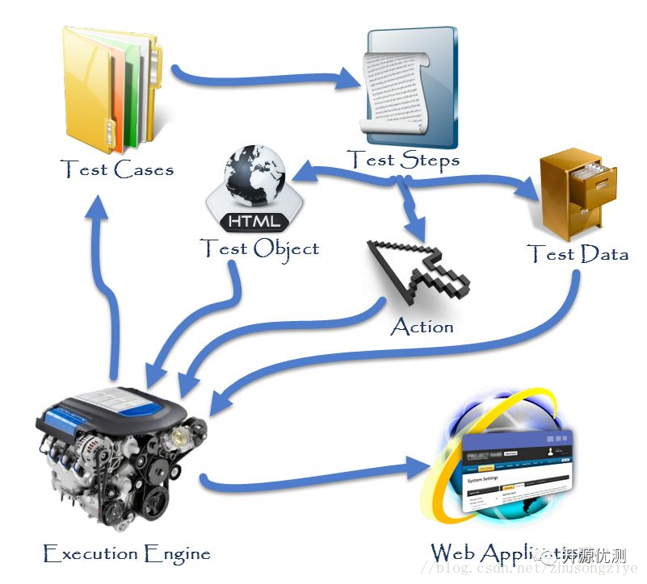
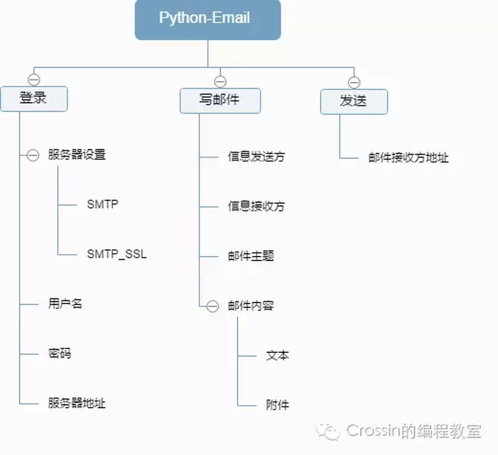
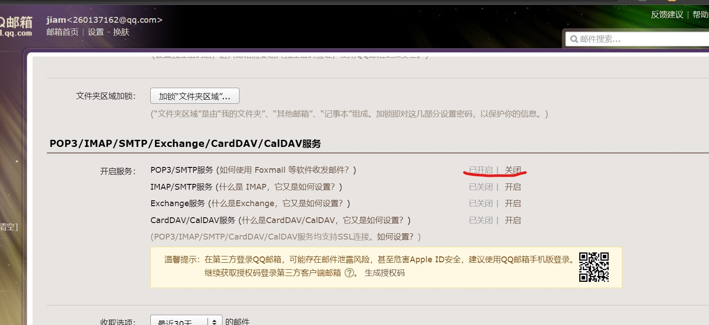

# 关键字驱动框架
[toc]

## 自动化测试框架

### 什么是自动化测试框架
自动化测试框架就是用于测试自动化的框架。具体来说，它提供了自动化测试用例编写、自动化测试用例执行、自动化测试报告生成等基础功能。我们只需要基于这个框架，完成和业务高度相关的测试用例设计和实现即可。另外，框架会为我们处理好复杂度与扩展性的问题，我们无需为此操心。

### 自动化测试框架的好处
+ 降低脚本维护成本
+ 节省人力成本
+ 提高测试速度和效率
+ 可重用的测试代码
+ 易于报告

### 常见的自动化测试框架


#### 线程测试框架
这是最基本的框架类型。它通常被称为`记录和回放`框架。在此过程中，测试代码的创建和执行以线性或顺序方式编写-测试人员手动记录每个步骤并自动播放记录的脚本。这些步骤包括导航，用户输入和检查点。最适合小型应用程序或小团队。

**优点**

线性框架最大的好处是生成测试用例的速度快，直接录制；无须代码基础，无须手动编写测试代码，因此门槛较低、易于上手。

#### 数据驱动框架
在数据驱动框架中，测试数据和测试脚本是分离的。在许多测试场景中，需要使用不同的测试数据多次测试同一功能或特性。如果测试数据是硬编码进测试脚本的，那么每更换一次测试数据都需要修改测试脚本。这是很大的工作量。此时，可以使用数据驱动框架。具体来说，测试脚本是固定的，而测试数据可以从外部的数据文件，以Excel、CSV、SQL等形式作为参数传入测试脚本。这样，我们只需要维护一份脚本和一份数据文件即可

**优点**

这种框架最大的好处就是易于维护。测试脚本中的任何更改都不会影响测试数据。因此，可以避免对数据进行硬编码。可以使用多组数据进行测试。


#### 关键字驱动框架
该框架是数据驱动框架的扩展。测试数据和测试脚本也被分离，不同的是，该框架要更进一步地将测试脚本中的通用功能剥离出来，形成关键词(keyword)。测试脚本本质上就是对一系列通用的或者自定义的关键词的调用。这样做的好处是关键词可以在多个测试中复用，并且测试脚本更加易于维护。

**优点**

总体来说，这种框架最大的好处就是易于维护。测试脚本中的任何更改都不会影响测试数据。因此，可以避免对数据进行硬编码。可以使用多组数据进行测试。

### 如何开发一个自动测试框架

面对一个新的自动化测试框架，如何着手工作呢？我们应该聚焦在以下四个问题上

1. 如何生成测试用例
2. 如何执行测试用例
3. 如何检查结果
4. 如何扩展测试框架

## 关键字驱动框架开发

我们做关键字的驱动的思想，就是把编码从测试用例和测试步骤中分离出来，这样对于不会编码的人员更容易理解自动化，从而让手工测试人员也可以编写自动脚本。（这并不意味这不需要自动化测试人员，对于自动化框架的构建，自动化代码的更新，结构调整等都需要一个技术性的人员）对于测试小的项目的团队，可以有两个手工测试人员和一个自动化测试人员。

### 关键驱动工作流程
关键字驱动的框架的基本工作是将测试用例分成四个不同的部分。首先是测试步骤（Test Step），二是测试步骤中的对象（Test Object），三是测试对象执行的动作(Action)，四是测试对象需要的数据（Test Data）。

+ Test Step：是一个小的测试步骤的描述或者测试对象的一个操作说明。
+ Test Object：是指页面对象或元素，就像用户名、密码，
+ Action：指页面操作的动作，打开浏览器，点击一个按钮，文本框输入一串文本等。
+ Test Data:是任何对象操作时所需要的值，就像用户名、密码进行输入时的输入内容。

通过一个简单的登录功能例子来理解这个概念，想想看你的自动化流程需要做哪些事情：

1. 打开一个浏览器
2. 输入url跳转到网站首页
3. 点击“登录”链接，进入登录页面
4. 输入“用户名”
5. 输入“密码”
6. 点击“登录”按钮，进行登录
7. 点击“注销”按钮，退出登录
8. 关闭浏览器 

下面图片展示了关键字框架的通用工作流程


1. 测试用例由测试步骤组成
2. 测试步骤由测试对象、动作、测试数据组成
3. 执行引擎用来执行测用例

### 如何设计程序？
从上面设计的用例出发，我们依次来分析需要实现的功能。

我们希望的是自动化框架脚本能读取每一行用例，然后在执行后把测试结果也填好，如果执行出错要有错误信息、错误截图。那我们需要完成以下代码的编写。
1. Excel操作（读、写）,读取关键字名称、操作元素定位方式、操作元素定位表达式、操作值.执行完成后写入执行时间、测试结果、错误信息
2. 根据关键字名称、操作元素定位方式、操作元素定位表达式、操作值开发web操作脚本
3. 执行用例的方法脚本
4. 错误信息记录方法脚本
5. 发送报告邮件

### 依赖的基础模块
+ 日志-logging
+ 读写excel-xlrd、Xlwt、xlutils
+ 操作浏览器-selenium
+ 发送邮件-smtplib，email

### logging

#### 日志概念
日志是一种可以追踪某些软件运行时所发生事件的方法。软件开发人员可以向他们的代码中调用日志记录相关的方法来表明发生了某些事情。

1. 日志的作用
+ 程序调试
+ 了解软件程序运行情况，是否正常
+ 软件程序运行故障分析与问题定位

2.日志级别

|日志等级（level）|	描述|
|-|-|
|DEBUG|	最详细的日志信息，典型应用场景是 问题诊断|
|INFO|	信息详细程度仅次于DEBUG，通常只记录关键节点信息，用于确认一切都是按照我们预期的那样进行工作|
|WARNING|	当某些不期望的事情发生时记录的信息（如，磁盘可用空间较低），但是此时应用程序还是正常运行的|
|ERROR|	由于一个更严重的问题导致某些功能不能正常运行时记录的信息|
|CRITICAL|	当发生严重错误，导致应用程序不能继续运行时记录的信息|

3. 日志字段信息与日志格式
一条日志信息对应的是一个事件的发生，而一个事件通常需要包括以下几个内容：

+ 事件发生时间
+ 事件发生位置
+ 事件的严重程度--日志级别
+ 事件内容
上面这些都是一条日志记录中可能包含的字段信息，当然还可以包括一些其他信息，如进程ID、进程名称、线程ID、线程名称等。
**日志格式** 就是用来定义一条日志记录中包含那些字段的，且日志格式通常都是可以自定义的。

#### logging模块的使用方式

logging模块提供了两种记录日志的方式：

+ 第一种方式是使用logging提供的模块级别的函数
+ 第二种方式是使用Logging日志系统的四大组件类

#### 使用函数记录日志

1.最简单的日志输出
```python
import logging

logging.debug("This is a debug log.")
logging.info("This is a info log.")
logging.warning("This is a warning log.")
logging.error("This is a error log.")
logging.critical("This is a critical log.")
```
+ 结果只输出了3条日志。这是因为logging模块提供的日志记录函数所使用的日志器设置的日志级别是WARNING，因此只有WARNING级别的日志记录以及大于它的ERROR和CRITICAL级别的日志记录被输出了，而小于它的DEBUG和INFO级别的日志记录被丢弃了。
+ 日志的默认格式为 日志级别:日志器名称:日志内容
+ 日志默认输出到标准输出

2. 日志配置
使用logging.basicConfig(**kwargs)函数进行配置
该函数常用关键字参数如下：

参数名称|	描述
-|-
filename|	指定日志输出目标文件的文件名，指定该设置项后日志信心就不会被输出到控制台了
format|	指定日志格式字符串，即指定日志输出时所包含的字段信息以及它们的顺序。logging模块定义的格式字段下面会列出。
level|	指定日志器的日志级别

3. logging模块定义的格式字符串字段

字段/属性名称|	使用格式|	描述
-|-|-|
asctime|	%(asctime)s|	日志事件发生的时间--人类可读时间，如：2003-07-08 16:49:45,896
created|	%(created)f|	日志事件发生的时间--时间戳，就是当时调用time.time()函数返回的值
msecs|	%(msecs)d|	日志事件发生事件的毫秒部分
levelname|	%(levelname)s|	该日志记录的文字形式的日志级别（'DEBUG', 'INFO', 'WARNING', 'ERROR', 'CRITICAL'）
levelno|	%(levelno)s|	该日志记录的数字形式的日志级别（10, 20, 30, 40, 50）
name|	%(name)s|	所使用的日志器名称，默认是'root'，因为默认使用的是 rootLogger
message|	%(message)s|	日志记录的文本内容，通过 msg % args计算得到的
pathname|	%(pathname)s|	调用日志记录函数的源码文件的全路径
filename|	%(filename)s|	pathname的文件名部分，包含文件后缀
module|	%(module)s|	filename的名称部分，不包含后缀
lineno|	%(lineno)d|	调用日志记录函数的源代码所在的行号
funcName|	%(funcName)s|	调用日志记录函数的函数名
process|	%(process)d|	进程ID
processName|	%(processName)s|	进程名称，Python 3.1新增
thread|	%(thread)d|	线程ID
threadName|	%(thread)s|	线程名称

4. 配置日志

配置日志级别
```python
import logging
logging.basicConfig(level=logging.DEBUG)

logging.debug("This is a debug log.")
logging.info("This is a info log.")
logging.warning("This is a warning log.")
logging.error("This is a error log.")
logging.critical("This is a critical log.")
```
在配置日志器日志级别的基础上，在配置下日志输出目标文件和日志格式
```python
import logging

LOG_FORMAT = "%(asctime)s - %(levelname)s - %(message)s"
logging.basicConfig(filename='my.log', level=logging.DEBUG, format=LOG_FORMAT)

logging.debug("This is a debug log.")
logging.info("This is a info log.")
logging.warning("This is a warning log.")
logging.error("This is a error log.")
logging.critical("This is a critical log.")
```
5. 重要说明
+ logging.basicConfig()函数是一个一次性的简单配置工具使，也就是说只有在第一次调用该函数时会起作用，后续再次调用该函数时完全不会产生任何操作的，多次调用的设置并不是累加操作。
+ 日志器（Logger）是有层级关系的，上面调用的logging模块级别的函数所使用的日志器是RootLogger类的实例，其名称为'root'，它是处于日志器层级关系最顶层的日志器，且该实例是以单例模式存在的。

+ 如果要记录的日志中包含变量数据，可使用一个格式字符串作为这个事件的描述消息（logging.debug、logging.info等函数的第一个参数），然后将变量数据作为第二个参数*args的值进行传递，如:logging.warning('%s is %d years old.', 'Tom', 10)，输出内容为WARNING:root:Tom is 10 years old.

#### 使用组件类记录日志

|组件名称|	对应类名|	功能描述
-|-|-
日志器|	Logger|	提供了应用程序可一直使用的接口
处理器|	Handler|	将logger创建的日志记录发送到合适的目的输出
过滤器|	Filter|	提供了更细粒度的控制工具来决定输出哪条日志记录，丢弃哪条日志记录
格式器|	Formatter|	决定日志记录的最终输出格式

这些组件之间的关系描述：
日志器（logger）需要通过处理器（handler）将日志信息输出到目标位置，如：文件、sys.stdout、网络等；
不同的处理器（handler）可以将日志输出到不同的位置；
日志器（logger）可以设置多个处理器（handler）将同一条日志记录输出到不同的位置；
每个处理器（handler）都可以设置自己的过滤器（filter）实现日志过滤，从而只保留感兴趣的日志；
每个处理器（handler）都可以设置自己的格式器（formatter）实现同一条日志以不同的格式输出到不同的地方。

简单点说就是：日志器（logger）是入口，真正干活儿的是处理器（handler），处理器（handler）还可以通过过滤器（filter）和格式器（formatter）对要输出的日志内容做过滤和格式化等处理操作。

```python
import logging
import logging.handlers

logger = logging.getLogger('mylogger')
logger.setLevel(logging.DEBUG)

rf_handler = logging.StreamHandler()
rf_handler.setFormatter(logging.Formatter("%(asctime)s - %(levelname)s - %(message)s"))

f_handler = logging.FileHandler('error.log')
f_handler.setLevel(logging.ERROR)
f_handler.setFormatter(logging.Formatter("%(asctime)s - %(levelname)s - %(filename)s[:%(lineno)d] - %(message)s"))

logger.addHandler(rf_handler)
logger.addHandler(f_handler)

logger.debug('debug message')
logger.info('info message')
logger.warning('warning message')
logger.error('error message')
logger.critical('critical message')
```
### 读写excel
+ xlwt模块用于在内存中生成一个xls/xlsx对象，增加表格数据，并把内存中的xls对象保存为本地磁盘xls文件;
+ xlrd模块用于把本地xls文件加载到内存中，可以读取xls文件的表格数据，查询xls文件的相关信息;
+ xlwt可以生成xls文件，xlrd可以读取已经存在的xls文件，但是如果要修改本地已经存在的xls文件，就需要用到xlutils模块。
+ xlutils模块是xlrd和xlwt之间的桥梁，可以使用xlutils模块中的copy模块，拷贝一份通过xlrd读取到内存中的xls对象，就可以在拷贝对象上像xlwt中那样修改xls表格的内容，并保存到本地。


```python
import xlwt
import xlrd
import xlutils.copy
 
 
workbook = xlwt.Workbook()     #使用xlwt新生成一个workbook
sheet = workbook.add_sheet("sheet1")   #增加一个名称为sheet1的sheet
sheet2 = workbook.add_sheet("sheet2")

row0 = ['Order', 'Name', 'Class', 'Socer', 'Num'] #第一行内容
row1 = [u'1', u'Tom', u'4', u'87', u'B']
row2 = [u'2', u'Mars', u'4', u'91', u'A']

for i in range(len(row0)):
    sheet.write(0, i, row0[i])    #write(行，列，值)
    sheet.write(1, i, row1[i])
    sheet.write(2, i, row2[i])

workbook.save('./data.xls')   #保存workbook为xls格式


workbook = xlrd.open_workbook('./data.xls')  #使用xlrd打开本地的workbook
num_sheet = workbook.nsheets     #workbook内总的sheet数量
names_sheet = workbook.sheet_names()   #workbook中所有sheet名称的列表
sheet1 = workbook.sheet_by_index(0)   #根据序号获取sheet
sheet2 = workbook.sheet_by_index(1)

sheet = workbook.sheet_by_name(u'sheet1')  #根据sheet名称获取sheet

sheet_name = sheet1.name   #sheet名称
sheet_rows = sheet1.nrows  #sheet总的行数
sheet_clos = sheet1.ncols  #sheet总的列数

val2 = sheet1.row_values(2)  #第n+1行内容的列表
print(val2)
val3 = sheet1.col_values(0)  #第n+1列内容的列表
print(val2)
value = sheet1.row(1)[0].value #row(rows)(cols) 第rows+1行第cols+1列所在表格的内容
print(value)

value = sheet1.col(1)[0].value  #col(cols)(rows) 第cols+1列第rows+1行所在表格的内容
print(value)

value = sheet1.cell(1,0) #cell(row,col) 第row+1行第col+1的cell对象
print(value)


workbook_xlutils = xlutils.copy.copy(workbook)  #使用xlrd打开一个已存在的xls，并通过xlutils复制
sheet1_xlutils = workbook_xlutils.get_sheet(0)  #通过sheet序号获取sheet

row3 = [u'3', u'Kim', u'4', u'100', u'A+']
row4 = [u'4', u'Klus', u'4', u'98', u'A+']
for i in range(len(row3)):                   #写入sheet_xlutils的修改值
    sheet1_xlutils.write(3, i, row3[i])  #write(row,col，value) 
    sheet1_xlutils.write(4, i, row4[i])
sheet1_xlutils.write(5, 10, 99)

workbook_xlutils.save('./data2.xls')  #保存xls
```

### 发送邮件

#### 发送流程

使用脚本发送邮件的思路其实和客户端发送邮件一样，过程都是：

登录 —> 写邮件 —> 发送



#### 邮件模块
smtplib

是关于 SMTP（简单邮件传输协议）的操作模块，在发送邮件的过程中起到服务器之间互相通信的作用。

email

简单来说，即服务器之间通信的信息，包括信息头、信息主体等等。

举个简单的例子，当你登录邮箱，写好邮件后点击发送，这部分是由 SMTP 接管；而写邮件、添加附件是由 email 模块控制。

#### 开通qq邮箱smtp功能

登录qq邮箱，设置->账号，找到pop3/smtp服务，点击开启

然后点击生成授权码按照提示进行操作

#### 发送纯文本邮件

登录qq邮箱，向其它邮箱发送邮件

脚本分为三个步骤：

+ 设置好服务器端信息
+ 邮件主体信息
+ 登录发送

在处理文本时，我们需要使用 MIMEText 类
```python
import smtplib
from email.mime.text import MIMEText
#设置服务器所需信息
#邮箱服务器地址
mail_host = 'smtp.qq.com'  
#163用户名
mail_user = '260137162@qq.com'  
#密码(部分邮箱为授权码) 
mail_pass = 'dqoomkmjfovbbhga'   
#邮件发送方邮箱地址
sender = '260137162@qq.com'  
#邮件接受方邮箱地址，注意需要[]包裹，这意味着你可以写多个邮件地址群发
receivers = ['jiaminqiangx@163.com']  

#设置email信息
#邮件内容设置
message = MIMEText('content','plain','utf-8')
#邮件主题       
message['Subject'] = 'title' 
#发送方信息
message['From'] = sender 
#接受方信息     
message['To'] = ','.join(receivers) 

#登录并发送邮件
try:
    smtpObj = smtplib.SMTP() 
    #连接到服务器
    smtpObj.connect(mail_host,25)
    #登录到服务器
    smtpObj.login(mail_user,mail_pass) 
    #发送
    smtpObj.sendmail(
        sender,receivers,message.as_string()) 
    #退出
    smtpObj.quit() 
    print('success')
except smtplib.SMTPException as e:
    print('error',e) #打印错误
```

#### 带有附件的邮件
处理多种形态的邮件主体我们需要 MIMEMultipart 类，而处理图片需要 MIMEImage 类

```python
import smtplib
from email.mime.text import MIMEText
from email.mime.multipart import MIMEMultipart
from email.mime.image import MIMEImage
from email.header import Header

#设置登录及服务器信息
mail_host = 'smtp.qq.com'
mail_user = '260137162@qq.com'
mail_pass = 'dqoomkmjfovbbhga'   
sender = '260137162@qq.com'
receivers = ['jiaminqiangx@163.com']

#设置eamil信息
#添加一个MIMEmultipart类，处理正文及附件
message = MIMEMultipart()
message['From'] = sender
message['To'] = receivers[0]
message['Subject'] = 'title'
#推荐使用html格式的正文内容，这样比较灵活，可以附加图片地址，调整格式等
with open('测试.html','r') as f:
    content = f.read()
#设置html格式参数
part1 = MIMEText(content,'html','utf-8')

#添加一个txt文本附件
with open('测试.txt','r')as h:
    content2 = h.read()
#设置txt参数
part2 = MIMEText(content2,'plain','utf-8')
#附件设置内容类型，方便起见，设置为二进制流
part2['Content-Type'] = 'application/octet-stream'
#设置附件头，添加文件名。Header 对中文进行编码
part2['Content-Disposition'] = 'attachment;filename=%s' % Header('测试.txt','utf-8').encode()


#添加照片附件
with open('测试.jpg','rb')as fp:
    part3 = MIMEImage(fp.read())
    #与txt文件设置相似
    part3['Content-Type'] = 'application/octet-stream'
    part3['Content-Disposition'] = 'attachment;filename=%s' % Header('测试.jpg','utf-8').encode()
#将内容附加到邮件主体中
message.attach(part1)
message.attach(part2)
message.attach(part3)

#登录并发送
try:
    smtpObj = smtplib.SMTP()
    smtpObj.connect(mail_host,25)
    smtpObj.login(mail_user,mail_pass)
    smtpObj.sendmail(
        sender,receivers,message.as_string())
    print('success')
    smtpObj.quit()
except smtplib.SMTPException as e:
    print('error',e)
```

### selenium

#### 简单例子
下载selenumdriver,放到python安装目录
声明浏览器对象
```python
from selenium import webdriver#导入库
browser = webdriver.Chrome()#声明浏览器
url = 'https://www.baidu.com'
browser.get(url)#打开浏览器预设网址
print(browser.page_source)#打印网页源代码
browser.close()#关闭浏览器
```
上述代码运行后，会自动打开Chrome浏览器，并登陆百度打印百度首页的源代码，然后关闭浏览器
注意：如果selenumdriver 路径不在环境变量中，可以通过下面语句指定
`webdriver.Chrome(executable_path="d:/python3/chromedriver.exe")`

#### 查找元素
```python
from selenium import webdriver 
browser = webdriver.Chrome()
url = 'https://www.taobao.com'
browser.get(url)  

# 通过id查找元素
input_first = browser.find_element_by_id('q')

# 使用css 选择器查找
input_two = browser.find_element_by_css_selector('#q')
print(input_first)
print(input_two)
```

这里我们通过2种不同的方式去获取响应的元素，第一种是通过id的方式，第二个中是CSS选择器，结果都是相同的

查找元素方法
```python
# 通过name属性
find_element_by_name
# 通过id属性
find_element_by_id
# 通过xpath
find_element_by_xpath
# 链接文字
find_element_by_link_text
find_element_by_partial_link_text
# 通过标签名字
find_element_by_tag_name
# 通过css类
find_element_by_class_name
# 通过css选择器
find_element_by_css_selector
```

#### 使用by模块
```python
from selenium import webdriver
from selenium.webdriver.common.by import By

browser = webdriver.Chrome(executable_path="d:/python3/chromedriver.exe")
url = 'https://www.taobao.com'
browser.get(url)
input_1 = browser.find_element(By.ID, 'q')
print(input_1)
```

#### 多个元素查找

其实多个元素和单个元素的区别，举个例子：find_elements，返回所有元素,find_element，返回找到的第一个元素

```
from selenium import webdriver

browser = webdriver.Chrome()
url = 'https://www.taobao.com'
browser.get(url)
input = browser.find_elements_by_css_selector('.service-bd li')
print(input)
browser.close()
```
常用方法
```
find_elements_by_name
find_elements_by_id
find_elements_by_xpath
find_elements_by_link_text
find_elements_by_partial_link_text
find_elements_by_tag_name
find_elements_by_class_name
find_elements_by_css_selector
```

#### 交互
对于获取的元素调用交互方法
```python
from selenium import webdriver
import time
browser = webdriver.Chrome()
browser.get(url='https://www.baidu.com')
time.sleep(2)
input = browser.find_element_by_css_selector('#kw')
input.send_keys('python')
time.sleep(2)
input.clear()
input.send_keys('selenium')
button = browser.find_element_by_css_selector('#su')
button.click()
time.sleep(10)
browser.close()
```

#### 执行javascript

```python
from selenium import webdriver
browser = webdriver.Chrome()
browser.get("http://www.zhihu.com/explore")
# 滚动到滚动条底部
browser.execute_script('window.scrollTo(0,document.body.scrollHeight)')
# 弹窗
browser.execute_script('alert("To Bottom")')
```

#### 获取元素属性的指
使用get_attribute方法

```python
from selenium import webdriver
import time
browser = webdriver.Chrome()
browser.get("http://www.zhihu.com/explore")
input = browser.find_element_by_class_name('Input')
print(input)
print(input.get_attribute('class'))
print(input.get_attribute('id'))
time.sleep(2)
browser.quit()
```

#### 获取文本

```
from selenium import webdriver
browser = webdriver.Chrome()
browser.get("http://www.zhihu.com/explore")
header = browser.find_element_by_css_selector('div.ExploreHomePage-ContentSection-header')
print(header)
print(header.text)
```

[selenium文档](https://selenium-python-zh.readthedocs.io/en/latest/)

