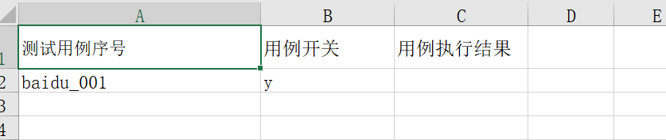
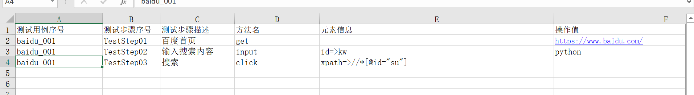

# 关键字驱动框架
[toc]
## 分层架构
分层组织代码
```bash
├── README.txt
├── config
│   └── config.ini
├── controller.py
├── lib
│   ├── base_page.py
│   ├── init_env.py
│   ├── log_config.py
│   ├── read_config.py
│   ├── send_email.py
│   └── special_methods.py
├── log
│   └── log.log
├── result
├── run_case.py
├── save_result.py
└── testcase
    ├── demo.xls
    └── testcase.xls
```
1. controller.py 入口，配置excel用例文件，调用run_case.py执行用例
2. run_case：执行引擎用来执行测用例，读取excel用例文件，一条条执行，记录执行成功、失败的用例、每步执行结果
3. save_result.py 将测试结果写入excel，放入result目录
4. config 配置文件目录
5. lib 关键字方法，日志，读写excel，发送邮件等基本功能实现
6. testcase 用例文件目录
7. log 日志文件目录

## 编写通用功能
编写框架抽象的通用代码的功能
### 日志功能
文件lib/log_config.py

```python
import logging
import os
from logging.handlers import RotatingFileHandler


'''
    CRITICAL > ERROR > WARNING > INFO > DEBUG > NOTSET
'''

def customer_config():
    
    logpath = os.path.join(os.path.dirname(os.path.dirname(__file__)),'log')
    log_file = os.path.join(logpath,'log.log')
    print(log_file)
    if not os.path.exists(logpath):
        os.makedirs(logpath)


    logging.root.setLevel(logging.INFO)
    # 控制台、日志文件输出日志格式设置
    format1=logging.Formatter('[%(asctime)s] [%(name)s] [%(levelname)s] %(lineno)s %(message)s')
    format2=logging.Formatter('[%(name)s] [%(levelname)s] %(lineno)s %(message)s')
    # 创建控制台输出日志的handler
    ch=logging.StreamHandler()
    ch.setLevel(logging.DEBUG)
    ch.setFormatter(format2)
    # 创建文件输出日志的handler
    fh=RotatingFileHandler(log_file,maxBytes=10*1024*1024,backupCount=10,encoding='utf-8') # 日志文件最大10M，最多备份5个文件
    fh.setLevel(logging.DEBUG)
    fh.setFormatter(format1)
    # 为logging添加handler
    logging.root.addHandler(ch)
    logging.root.addHandler(fh)

customer_config()

def get_logger(name='root'):
    return logging.getLogger(name)

if __name__=='__main__':
    mylogger=get_logger('666')
    mylogger.debug('Test start !')
    mylogger.info('Test start !')
    mylogger.error('Test start !')
```

### 解析配置文件
config/config.ini 配置文件
```
[email]
mailto_list = jiaminqiangx@163.com,260137162@qq.com
mail_host =smtp.qq.com
mail_from=260137162@qq.com
#密码是假的
mail_pass=dqoomkmjfovbbhga
mail_postfix=jmq

[browser]
browser = chrome
```


lib/read_config.py解析配置文件

```python
import configparser
import os

def readConfig(file,field,key):
    '''

    :param file:
    :param field:
    :param key:
    :return:
    '''
    config = configparser.ConfigParser()
    conf_path = os.path.abspath(os.path.join(os.path.dirname(__file__),"..","config",file))
    config.readfp(open(conf_path, "r", encoding='UTF-8'))

    return config.get(field, key)

if __name__ =='__main__':
    server= readConfig('config.ini','server','server')
```

### 发送邮件
lib/send_email.py 实现发送邮件功能

```python
import os
import smtplib
from email.header import Header
from email.mime.multipart import MIMEMultipart

from email.mime.text import MIMEText

from log_config import get_logger
from read_config import readConfig
_mylogger = get_logger('send_mail')

mailto_list = readConfig('config.ini','email','mailto_list').replace(' ','').split(',') # 收件人列表
mail_host = readConfig('config.ini','email','mail_host') # 配置邮件服务器
mail_from = readConfig('config.ini','email','mail_from') #发件人
mail_pass = readConfig('config.ini','email','mail_pass') #密码


def send_mail( sub, content, reportFile ):          # to_list：收件人；sub：主题；content：邮件内容
    msg = MIMEMultipart()
    msg.attach(MIMEText(content, 'plain', 'utf-8'))
    part = MIMEText(open(reportFile, 'rb').read(), 'base64', 'utf-8')
    part["Content-Type"] = 'application/octet-stream'
    part["Content-Disposition"] = 'attachment; filename="%s"'%reportFile
    msg.attach(part) #添加附件

    msg['subject'] = Header(sub, 'utf-8')
    msg['From'] = mail_from
    msg['To'] = ','.join(mailto_list) #兼容多个收件人
    smtp = smtplib.SMTP()

    try:
        smtp.connect(mail_host)
        smtp.login(mail_from, mail_pass)
        smtp.sendmail(mail_from, mailto_list, msg.as_string())
        smtp.close()
        _mylogger.info('带附件测试报告发送成功！')
        return True
    except (Exception) as e:
        _mylogger.error('邮件发送失败：%s' %e)
        return False
if __name__ == '__main__':
    content= "测试"
    reportFile = 'log_config.py'
    email_result = send_mail("自动化测试结果",content, reportFile)
    if email_result:
        print ("发送成功")
    else:
        _mylogger.error(email_result)
        print ("发送失败")
```
### 浏览器操作
lib/init_driver.py 初始话浏览器
```python
'''
用于初始化浏览器，并新建浏览器driver
'''
import os

from selenium import webdriver

from log_config import get_logger

_mylogger = get_logger(os.path.basename(__file__))
class init_driver():
    def __init__(self):
        pass
    def open_browser(self, browser = 'chrome'):
        if str.lower(browser) == 'chrome':
            driver = webdriver.Chrome()
            _mylogger.info(u'chrome浏览器已经申明')
        elif str.lower(browser) == 'firefox':
            driver = webdriver.Firefox()
            _mylogger.info(u'firefox浏览器已经申明')
        elif str.lower(browser) == 'ie':
            driver = webdriver.Ie()
            _mylogger.info(u'ie浏览器已经申明')
        else :
            _mylogger.warning(u'不知道的浏览器')
            exit()
        driver.maximize_window()
        return driver

if __name__ == "__main__":
    d = init_driver()
    d.open_browser('chrome')
```

lib/base_page.py 封装基本方法
```python
import os
import os.path
import time
from selenium.webdriver.support.select import Select
from .init_driver import init_driver
from .log_config import get_logger

'''
页面操作常用方法集合
'''

_mylogger = get_logger(os.path.basename(__file__))


class BasePage(object):

    """
    定义一些基类，让所有页面都继承这个类，封装定位元素的常用方法，以及元素的常用操作
    """

    def __init__(self, driver):
        self.driver = driver
        # self.driver = init_env().open_browser('chrome')

   
    # 基本方法
    def back(self):
        self.driver.back()
        _mylogger.info('后退')

    def forward(self):
        self.driver.forward()
        _mylogger.info('前进')

    def close(self):
        self.driver.close()
        _mylogger.info('关闭当前窗口')

    def quit_browser(self):
        self.driver.quit()
        _mylogger.info('退出')

    def wait(self, seconds):
        self.driver.implicitly_wait(seconds)
        _mylogger.info('等待{}秒'.format(seconds))

    def get_window_img(self):
        imgPath = os.path.join(os.path.dirname(os.path.dirname(os.path.abspath(__file__))),"screenshot")
        if not os.path.exists(imgPath):
            os.makedirs(imgPath)
        screen_name = os.path.join(imgPath, time.strftime('%Y%m%d%H%M%S', time.localtime(time.time())) + '.png')
        try:
            self.driver.get_screenshot_as_file(screen_name)
            _mylogger.info('已截图，保存在{}'.format(screen_name))
        except NameError as e:
            _mylogger.error('截图失败，异常信息：{}'.format(e))

    def find(self, selector):
        '''
        通过传入的selector自动识别定位方式，并定位到元素再返回element
        定位方式包括：by_id,by_tag_name,by_class_name,by_name,by_link_text,by_partial_link_text,by_css_selector,by_xpath
        selector规范：selector_by=>selector_value
        :param selector:
        :return: element
        '''
        if '=>' not in selector:
            return self.driver.find_element_by_id(selector)
        selector_by = selector.split('=>')[0]
        selector_value = selector.split('=>')[1]
        element = None
        if selector_by == 'i' or selector_by == 'id':
            try:
                _mylogger.info('开始通过{}查找元素{}'.format(selector_by, selector_value))
                element = self.driver.find_element_by_id(selector_value)
            except:
                element = None
        elif selector_by == 'n' or selector_by == 'name':
            try:
                _mylogger.info('开始通过{}查找元素{}'.format(selector_by, selector_value))
                element = self.driver.find_element_by_name(selector_value)
            except:
                element = None
        elif selector_by == 'c' or selector_by == 'class_name':
            try:
                _mylogger.info('开始通过{}查找元素{}'.format(selector_by, selector_value))
                element = self.driver.find_element_by_class_name(selector_value)
            except:
                element = None
        elif selector_by == 't' or selector_by == 'tag_name':
            try:
                _mylogger.info('开始通过{}查找元素{}'.format(selector_by, selector_value))
                element = self.driver.find_element_by_tag_name(selector_value)
            except:
                element = None
        elif selector_by == 'l' or selector_by == 'link_text':
            try:
                _mylogger.info('开始通过{}查找元素{}'.format(selector_by, selector_value))
                element = self.driver.find_element_by_link_text(selector_value)
            except:
                element = None
        elif selector_by == 'p' or selector_by == 'partial_link_text':
            try:
                _mylogger.info('开始通过{}查找元素{}'.format(selector_by, selector_value))
                element = self.driver.find_element_by_partial_link_text(selector_value)
            except:
                element = None
        elif selector_by == 'x' or selector_by == 'xpath':
            try:
                _mylogger.info('开始通过{}查找元素{}'.format(selector_by, selector_value))
                element = self.driver.find_element_by_xpath(selector_value)
            except:
                element = None
        elif selector_by == 's' or selector_by == 'selector_selector':
            try:
                _mylogger.info('开始通过{}查找元素{}'.format(selector_by, selector_value))
                element = self.driver.find_element_by_css_selector(selector_value)
            except:
                element = None
        return element

    def find_element(self, selector):
        '''
        本方法会先在default_content中查找，若页面存在iframe，没有定位到元素会遍历页面中所有的frame去查找元素
        :param selector:
        :return: element
        '''

        # 切到默认
        self.driver.switch_to_default_content()

        element = self.find(selector)
        if element is not None:
            return element

        # 判断页面中是否存在iframe，如果有就遍历
        iframes = self.driver.find_elements_by_tag_name('iframe')
        if iframes is None:
            _mylogger.error('未找到控件，发生异常')
            raise Exception('未找到控件，发生异常')
        for iframe in iframes:
            self.driver.switch_to.frame(iframe)
            _mylogger.info('default_content中未找到元素，切入{}继续查找'.format(iframe))
            element = self.find(selector)
            if element is not None:
                return element
        if element is None:
            _mylogger.error('查找元素失败')
            self.get_window_img()
            raise Exception('未找到控件，发生异常')

   
    def sleep(self,seconds):
        time.sleep(seconds)
        _mylogger.info("Sleep for %d seconds" % seconds)

    # 关键字方法两个参数selector，text分别对应 testcase.xls中的元素信息和操作值

    def get(self,selector=None, text=None):
        self.driver.get(text)
        _mylogger.info('打开页面:{}'.format(text))
        self.sleep(1)

    def input(self, selector=None, text=None):
        if selector is None:
            _mylogger.error('请正确填写元素信息')

        else:
            el = self.find_element(selector)
            try:
                el.clear()
                el.send_keys(text)
                _mylogger.info('已输入{}'.format(text))
            except Exception as e:
                _mylogger.error('发生异常{}'.format(e))
                self.get_window_img()

    def click(self, selector=None, text=None):
        if selector is None:
            _mylogger.error('请正确填写元素信息')

        else:
            el = self.find_element(selector)
            try:
                el.click()
                _mylogger.info('已点击按钮')
            except Exception as e:
                _mylogger.error('发生异常{}'.format(e))
                self.get_window_img()

    def clear(self, selector=None, text=None):
        if selector is None:
            _mylogger.error('请正确填写元素信息')
        else:
            el = self.find_element(selector)
            try:
                el.clear()
                _mylogger.info('已清空输入框')
            except Exception as e:
                _mylogger.error('发生异常{}'.format(e))
                self.get_window_img()

    def seletor(self, selector=None, text=None):
        if selector is None:
            _mylogger.error('请正确填写元素信息')
        else:
            el = self.find_element(selector)
            try:
                el.click()
                selector = Select(el)
                selector.select_by_value(text)
                _mylogger.info('从下拉框中选择{}'.format(text))
            except Exception as e:
                _mylogger.error('发生异常{}'.format(e))
                self.get_window_img()

    # 或者网页标题
    def get_page_title(self, selector=None, text=None):
        _mylogger.info("Current page title is %s" % self.driver.title)
        return self.driver.title
    # 滚动
    def scroll_page(self, selector=None, text=None):
        # 向下滚动
        self.driver.execute_script("window.scrollTo(0,1000)")
        time.sleep(2)
        # 向上滚动
        self.driver.execute_script("window.scrollTo(0,0)")
        time.sleep(1)

    
if __name__ == '__main__':
    driver = init_driver().open_browser('Chrome')
    homepage = BasePage(driver)
    homepage.get(None,'http://www.baidu.com')
    homepage.sleep(1)
    homepage.input('id=>kw', 'python')
    homepage.sleep(1)
    homepage.click('xpath=>//*[@id="su"]')
    homepage.sleep(1)
    homepage.quit_browser()

```
封装的关键字为：get,input,click,clear,selector,get_page_title,scroll_page
get: 打开网页
input： 定位输入框，输入内容
clikc： 定位按钮，进行点击
clear：定位元素，清空内容
selector： 下拉选择框
get_page_title: 获取标题
scroll_page: 滚动条

lib/special_method.py 针对业务的自定义方法
```python
import os

import time

from .base_page import BasePage
from .log_config import get_logger

_mylogger = get_logger(os.path.basename(__file__))
class SpecialMethods(BasePage):
    def __init__(self, driver):
        # self.driver = driver
        super().__init__(driver)
```


## 用例
### 构建用例数据
创建目录 testcase,放入文件testcase.xls
excel中包含两个sheet，分别为用例集和用例




### 执行用例
项目根目录创建文件 run_case.py 执行测试用例

```python
import os
import time
import xlrd
from lib.base_page import BasePage
from lib.init_driver import init_driver
from lib.log_config import get_logger
from lib.read_config import readConfig
from lib.special_methods import SpecialMethods

'''
    从用例文件中读取用例集、用例
    根据用例集中标识，顺序执行用例sheet中的用例
'''
_mylogger =get_logger(os.path.basename(__file__))

class run_case():
    def __init__(self,):
        browser = readConfig('config.ini', 'browser', 'browser')
        self.driver = init_driver().open_browser(browser)
        # self.basePageAction = BasePage(driver)
        # 每步执行结果
        self.stepResult ={}
        # 测试集合执行结果
        self.caseResult ={}

    def run_test(self, caseFile):
        '''
        读取并执行用例
        将用例的分步执行结果保存到stepResult字典中
        每条用例的执行结果保存到caseResult字典中
        :param caseFile:
        :return: stepResult，caseResult
        '''
        # 打开excel case，第一个sheet为用例集，第二个sheet为用例步骤明细
        data = xlrd.open_workbook(caseFile)
        # 获取用例集
        caseGatherSheet = data.sheet_by_index(0)
        # 读取第一个sheet，获取用例集，以及是否需要执行，存放到casegather字典中
        casegather = {}
        for i in range(1,caseGatherSheet.nrows):
            # 用例序号
            caseNo = caseGatherSheet.row_values(i)[0]
            # 用例开关
            caseSwitch = caseGatherSheet.row_values(i)[1]
            try:
                # 用例集中，如果用例序号重复，以最后一条为准
                casegather[caseNo] = caseSwitch
            except Exception as e:
                _mylogger.error('获取用例集发生异常：{}\n请确认测试用例序号是否有重复！！！'.format(e))
                exit()
        # 获取用例具体步骤：
        caseStepSheet = data.sheet_by_index(1)
        # 获取表的行数
        rows = caseStepSheet.nrows
        for i in range(1, rows):
            row = caseStepSheet.row_values(i)
            try:
                caseNo = str(row[0])
                caseStepNo = str(row[1])
                caseStepName = str(row[2])
                caseFunName = str(row[3])
                caseKeyInfo = str(row[4])
                caseKeyValue = str(row[5])
                # 判断用例集是否需要执行
                if caseNo not in casegather.keys() :
                    _mylogger.info('用例集中不存在{}用例，跳过'.format(caseNo))
                    self.stepResult[i] = u'用例集未包含用例，跳过'
                    continue
                if str.lower(casegather[caseNo]) != 'y':
                    _mylogger.info('{}用例已设置为不执行，跳过'.format(caseNo))
                    self.stepResult[i] = u'用例集设置为不执行，跳过'
                    continue

                _mylogger.info(u'开始执行{}用例的{},{}'.format(caseNo,caseStepNo,caseStepName))
                time.sleep(0.5)
                # 使用python的反射机制，判断方法名是否存在
                fuc = getattr(BasePage(self.driver), caseFunName, u'方法不存在')
                if fuc == u'方法不存在':
                    # 判断异常类型为方法未定义，则进入special_methods中执行
                    fuc = getattr(SpecialMethods(self.driver), caseFunName,u'方法不存在')
                try:
                    fuc(caseKeyInfo, caseKeyValue)
                    self.stepResult[i] = u'步骤执行成功'
                    time.sleep(0.5)
                except Exception as e:
                    _mylogger.error(u'执行方法发生异常：{}，异常信息：{}'.format(caseFunName,e))
                    self.stepResult[i] = u'步骤执行失败'
                    # 判断是否为用例的最后一个step，如果是，则返回用例的执行结果
                if (i == rows-1 or caseNo != str(caseStepSheet.row_values(i+1)[0])):
                    if self.stepResult[i] == '步骤执行成功':
                        self.caseResult[caseStepSheet.row_values(i)[0]] = u'执行成功'
                    else:
                        self.caseResult[caseStepSheet.row_values(i)[0]] = u'执行失败'
                else :
                    pass
            except Exception as e:
                _mylogger.error(u'读取用例发生异常：', e)
        time.sleep(3)
        BasePage(self.driver).quit_browser()
        return self.stepResult, self.caseResult
if __name__ == '__main__':
    run = run_case()
    run.run_test("testcase/testcase.xls")
```
getattr如果存在name的属性则返回name的值否则返回默认值，如果存在name的方法则返回name方法否则返回默认值

执行run_case.py 前修改lib/base_page.py文件
```
import os
import os.path
import time
from selenium.webdriver.support.select import Select
# 下面两行为修改内容
from .init_driver import init_driver
from .log_config import get_logger
```
修改lib/init_driver.py
```
import os
from selenium import webdriver
# 下面一行为修改内容
from .log_config import get_logger
```
修改lib/send_email.py
```
import os
import smtplib
from email.header import Header
from email.mime.multipart import MIMEMultipart

from email.mime.text import MIMEText
# 下面为修改内容
from .log_config import get_logger
from .read_config import readConfig
```

## 保存报告
项目根目录创建文件save_result.py 将执行结果写入excel文件

```python
from xlutils import copy
import os, time
import xlrd


def save_result(caseFile, stepResult, caseResult, resultPath):
    # 每步测试结果反写入excel
    data = xlrd.open_workbook(caseFile)
    newbook = copy.copy(data)
    # 将结果以String类型反写入用例step的第7列
    stepsheet = newbook.get_sheet(1)
    for i in stepResult.keys():
        stepsheet.write(int(i), 6, u'{}'.format(stepResult[i]))

    # 将结果以String类型反写入用例集的第3列
    casesheetR = data.sheet_by_index(0)
    casesheet = newbook.get_sheet(0)
    # 遍历用例集
    for j in range(1, casesheetR.nrows):
        caseNo = casesheetR.row_values(j)[0]
        caseSwitch = casesheetR.row_values(j)[1]
        for i in caseResult.keys():
            if str.lower(caseSwitch) == 'y' and str(caseNo) == i:
                casesheet.write(int(j), 2, u'{}'.format(caseResult[i]))
    if not os.path.exists(resultPath):
        os.makedirs(resultPath)
    reportFile = os.path.abspath(os.path.join(resultPath, 'Report@%s.xls' % time.strftime('%Y%m%d@%H%M%S')))
    newbook.save(reportFile)
    return reportFile

```
## 入口
项目根目录创建文件controller.py

```python
import os
from lib.log_config import get_logger
from lib.send_email import send_mail
from run_case import run_case
from save_result import save_result


'''
自动化测试执行入口
用例文件为:./testcase/testcase.xls
测试结果存放目录：./result
'''
_mylogger = get_logger(os.path.basename(__file__))


if __name__ == '__main__':
    rootPath = os.path.split(os.path.realpath(__file__))[0]
    _mylogger.info('主目录：'+rootPath)
    casePath = os.path.join(rootPath,'testcase')
    resultPath = os.path.join(rootPath,'result')
    caseFile = os.path.join(casePath,'testcase.xls')
    print('caseFile:'+caseFile)
    run = run_case()

    if os.path.exists(caseFile):
        # 打开excel文件读取数据
        stepResult, caseResult = run.run_test(caseFile)
        reportFile = save_result(caseFile, stepResult, caseResult, resultPath)
        # 邮件发送测试报告
        _mylogger.info(reportFile)
        send_mail(sub='测试报告', content='测试详情见附件', reportFile = reportFile)
    else:
        _mylogger.error('获取用例文件失败')
        exit()
```

