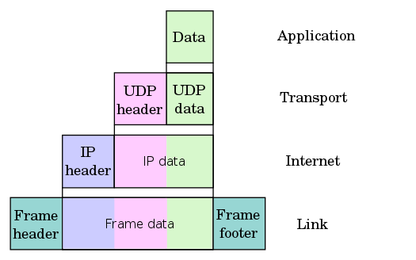
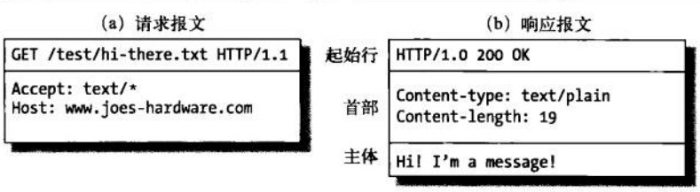
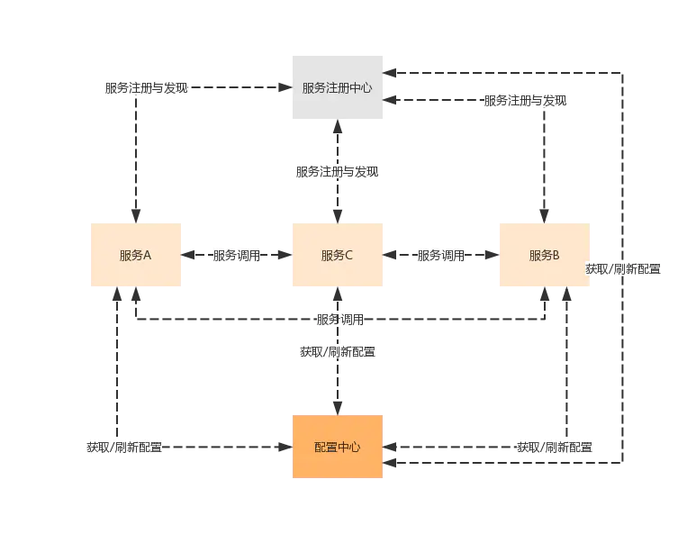

# 服务端测试
[toc]

## 什么是服务端测试
服务端测试有两种：一种是直接对WEB或者app的服务端进行测试；另一种是对更后端的数据库、缓存系统、中间件、文件系统等进行测试。

## 如何对服务端进行测试
服务端对外提供调用接口，对服务端首先就是接口测试，这些常见的接口类型有
+ http接口
+ restful接口
+ rpc接口
对于这类后端服务来说，接口只是暴露给外用的部分，内部逻辑通常是非常复杂的，所以，除了针对接口做测试之外，测试人员还需要细致地了解这些服务端产品的技术框架及技术实现，需要了解到模块的级别，对于系统框架图、时序图等都有很好的理解。针对这些理解去设计用例，再跟开发一起讨论如何实现用例。

除了接口测试外，还需要进行
1. 异常测试
异常测试会模拟各种异常情况，比如硬件异常－机器挂掉的情况下能否启动备机、硬盘挂掉的情况下是否会丢失数据；网络异常－网络忽然断掉、或者网络流量变小的情况；系统异常－操作系统忽然挂掉的情况。这些极端的情况出现的时候，我们需要验证数据有没有丢、能不能尽快启动备机对外提供服务、系统状态有没有异常等。
2. 稳定性测试
稳定性测试，就是模拟系统在7*24的运行下会不会出问题，一般会用接口测试或者性能测试用例不断地跑，在运行期间，我们会模拟各种情况，比如说负载的变化、系统的各种干扰等。
3. 性能测试
性能测试，也就是压力测试，模拟大量请求来观察服务器的响应情况。分析吞吐量，请求响应时间、错误率等

## tcp/ip
要进行接口测试，需要掌握基本的网络基础知识，如tcp/ip,http,dns等

TCP/IP参考模型是一个抽象的分层模型，这个模型中，所有的TCP/IP系列网络协议都被归类到4个抽象的"层"中。每一抽象层创建在低一层提供的服务上，并且为高一层提供服务。 完成一些特定的任务需要众多的协议协同工作，这些协议分布在参考模型的不同层中的，因此有时称它们为一个协议栈
### tcp/ip 模型
+ 应用层 （ftp http smtp）
+ 传输层 （tcp，udp）
+ 网络层 （ip,arp）
+ 链路层

当通过http发起一个请求时，应用层、传输层、网络层和链路层的相关协议依次对该请求进行包装并携带对应的首部，最终在链路层生成以太网数据包，以太网数据包通过物理介质传输给对方主机，对方接收到数据包以后，然后再一层一层采用对应的协议进行拆包，最后把应用层数据交给应用程序处理


首部和数据是报文的组成部分既header和data



协议封装
tcp/ip 协议栈从上往下逐层封帐


### osi模型

+ 应用层
+ 标识层
+ 会话层
+ 传输层
+ 网络层
+ 链路层
+ 物理层


### 概念
#### IP地址

由32位二进制数组成，为便于使用，常以XXX.XXX.XXX.XXX形式表现，每组XXX代表小于或等于255的10进制数，该表示方法称为点分十进制。例如维基媒体的一个IP地址是208.80.152.2。IP地址是唯一的。当前IPv4技术可能使用的IP地址最多可有4,294,967,296个（即2的32次方）

#### mac 地址
以太网地址（Ethernet Address）或物理地址（Physical Address），它是一个用来确认网络设备位置的地址。在OSI模型中，第三层网络层负责IP地址，第二层数据链接层则负责MAC地址。MAC地址用于在网络中唯一标示一个网卡，一台设备若有一或多个网卡，则每个网卡都需要并会有一个唯一的MAC地址

#### arp协议
地址解析协议（ARP）是一个通过ip地址来定位mac地址的协议，

同一局域网中的一台主机要和另一台主机进行直接通信，必须要知道目标主机的MAC地址。而在TCP/IP协议中，网络层和传输层只关心目标主机的IP地址。这就导致在网络中使用IP协议时，数据链路层接到上层IP协议提供的数据中，只包含目的主机的IP地址。于是需要一种方法，根据目的主机的IP地址，获得其MAC地址。这就是ARP协议要做的事情。所谓地址解析（address resolution）就是主机在发送帧前将目标IP地址转换成目标MAC地址的过程。

#### ip协议
IP是在TCP/IP协议族中网络层的主要协议，任务仅仅是根据源主机和目的主机的地址来传送数据。

#### tcp协议
是一种面向连接的、可靠的、基于字节流的传输层通信协议
建立连接，每个数据包都确认，丢包重传


#### upd协议

是一种无连接的、不可靠的、基于字节流的传输层通信协议

## 域名，DNS


网域名称（英语：Domain Name，简称：Domain），简称域名.是由一串用点分隔的字符组成的互联网上某一台计算机或计算机组的名称，用于在数据传输时标识计算机的电子方位。域名可以说是一个IP地址的代称，目的是为了便于记忆后者。例如，www.baidu.com是一个域名，和一个IP地址相对应。人们可以直接访问www.baidu.com来代替IP地址，然后域名系统（DNS）就会将它转化成便于机器识别的IP地址。这样，人们只需要记忆wikipedia.org这一串带有特殊含义的字符，而不需要记忆没有含义的数字。

域名的核心是域名系统（英语：Domain Name System，缩写：DNS），域名系统中的任何名称都是域名。在域名系统的层次结构中，各种域名都隶属于域名系统根域的下级。域名的第一级是顶级域，它包括通用顶级域，例如.com、.net和.org；以及国家和地区顶级域，例如.us、.cn和.tk。顶级域名下一层是二级域名，一级一级地往下。这些域名向人们提供注册服务，人们可以用它创建公开的互联网资源或运行网站。顶级域名的管理服务由对应的域名注册管理机构（域名注册局）负责，注册服务通常由域名注册商负责


dns解析过程


## http

HTTP的全称是Hyper Text Transfer Protocol，中文名叫作超文本传输协议


通俗来讲，http是计算机通过网络进行通信的规则，是一个基于请求与响应，无状态的，短连接，应用层的协议，常基于TCP/IP协议传输数据。

四个基于：

+ 请求与响应：客户端发送请求，服务器端响应数据

+ 无状态的：协议对于事务处理没有记忆能力，客户端第一次与服务器建立连接发送请求时需要进行一系列的安全认证匹配等，因此增加页面等待时间，当客户端向服务器端发送请求，服务器端响应完毕后，两者断开连接，也不保存连接状态，一刀两断！恩断义绝！从此路人！下一次客户端向同样的服务器发送请求时，由于他们之前已经遗忘了彼此，所以需要重新建立连接。

+ 应用层：Http是属于应用层的协议，配合TCP/IP使用。

+ TCP/IP：Http使用TCP作为它的支撑运输协议。HTTP客户机发起一个与服务器的TCP连接，一旦连接建立，浏览器（客户机）和服务器进程就可以通过套接字接口访问TCP。


HTTPS的全称是Hyper Text Transfer Protocol over Secure Socket Layer，是以安全为目标的HTTP通道，简单讲是HTTP的安全版，即HTTP下加入SSL层，简称为HTTPS。


### 一个http请求过程
首先要有请求地址url

1. 域名解析
2. 发起tcp连接(三次握手建立连接)
3. 建立TCP连接后发起http请求
4. 服务器端响应http请求，返回response
5. 关闭tcp连接

### URL

URL 格式
```
<scheme>://<user>:<password>@<host>:<port>/<path>;<params>?<query>#<frag>
<方案>://<用户>:<密码>@<主机>:<端口>/<路径>;<参数>?<查询>#<片段>
```
URL最重要的3个部分是方案(scheme)、主机(host)、和路径(path)

+ scheme  获取资源时要使用哪种协议（http，https，ftp，mailto，）
+ user  访问资源时需要的用户名
+ password  用户名后面可能要包含的密码，中间由冒号(:)分隔
+ host         域名/ip
+ port          端口
+ path         资源路径
+ ;params    参数，键/值对。URL中可以包含多个参数字段，它们相互之间以及与路径的其他部分之间用分号(;)分隔 
+ query    查询字符串，用"?"将其与URL的其余部分分隔开来 
+ frag    片段，一个网页中一部分资源的名字（访问html中的锚点）

使用python解析url
```
from urllib.parse import urlparse
obj = urlparse('https://baike.baidu.com/item/统一资源定位系统/5937042?fromtitle=url&fromid=110640')
print(obj)
print(obj.path)
print(obj.scheme)
```

http封装


### HTTP协议


http请求方法

常见的请求方法有两种：GET和POST
其它请求方法


报文


+ start line 起始行
+ header     头部
+ body       报文实体 

Header


状态码


常见body类型

+ application/x-www-form-urlencoded 表单
+ multipart/form-data
+ application/json
+ text/xml

使用postman发送请求，通过wireshark进行抓包，原始请求报文如下

表单
```
POST http://www.example.com HTTP/1.1
Content-Type: application/x-www-form-urlencoded;charset=utf-8

title=test&sub%5B%5D=1&sub%5B%5D=2&sub%5B%5D=3

```

使用表单上传文件时
```
POST http://www.example.com HTTP/1.1
Content-Type:multipart/form-data; boundary=----WebKitFormBoundaryrGKCBY7qhFd3TrwA

------WebKitFormBoundaryrGKCBY7qhFd3TrwA
Content-Disposition: form-data; name="text"

title
------WebKitFormBoundaryrGKCBY7qhFd3TrwA
Content-Disposition: form-data; name="file"; filename="chrome.png"
Content-Type: image/png

PNG ... content of chrome.png ...
------WebKitFormBoundaryrGKCBY7qhFd3TrwA--

```

json数据
```
POST http://www.example.com HTTP/1.1 
Content-Type: application/json;charset=utf-8

{"title":"test","sub":[1,2,3]}
```

xml 数据
```
POST http://www.example.com HTTP/1.1 
Content-Type: text/xml

<?xml version="1.0"?>
<methodCall>
    <methodName>examples.getStateName</methodName>
    <params>
        <param>
            <value><i4>41</i4></value>
        </param>
    </params>
</methodCall>

```
### Request

[requests](https://requests.readthedocs.io/zh_CN/latest/)
文档

get 请求
```python
import requests

r = requests.get("https://www.baidu.com")
print(r.text)
print(r.status_code)
print(r.cookies)
```

带参数的get请求

```python
import requests

data = {'name': 'test', 'age': 18}

r = requests.get("http://httpbin.org/get", params=data)
print(r.text)

```

post请求

```python
import requests

data = {'name': 'test', 'age': 18}

r = requests.post("http://httpbin.org/post", data=data)
print(r.text)

```

自定义header
```python
import requests

r = requests.get('https://www.zhihu.com/explore')
print(r.text)

import requests

headers= {
        'User-Agent': 'Mozilla/5.0 (Windows NT 10.0; WOW64) AppleWebKit/537.36 (KHTML, like Gecko) Chrome/70.0.3538.102 Safari/537.36'
}
r = requests.get('https://www.zhihu.com/explore', headers=headers)

print(r.text)
```

## 微服务介绍

要理解微服务，首先要先理解不是微服务的那些。通常跟微服务相对的是单体应用，即将所有功能都打包成在一个独立单元的应用程序。从单体应用到微服务并不是一蹴而就的，这是一个逐渐演变的过程。

### 单体应用

相对的，要理解什么是微服务，那么可以先理解什么是单体应用，在没有提出微服务的概念的“远古”年代，一个软件应用，往往会将应用所有功能都开发和打包在一起，那时候的一个B/S应用架构往往是这样的：


但是，当用户访问量变大导致一台服务器无法支撑时怎么办呢？加服务器加负载均衡，架构就变成这样了：


后面发现把静态文件独立出来，通过CDN等手段进行加速，可以提升应用的整体相应，单体应用的架构就变成：


上面3中架构都还是单体应用，只是在部署方面进行了优化，所以避免不了单体应用的根本的缺点：

代码臃肿，应用启动时间长；
回归测试周期长，修复一个小小bug可能都需要对所有关键业务进行回归测试。
应用容错性差，某个小小功能的程序错误可能导致整个系统宕机；
伸缩困难，单体应用扩展性能时只能整个应用进行扩展，造成计算资源浪费。
开发协作困难，一个大型应用系统，可能几十个甚至上百个开发人员，大家都在维护一套代码的话，代码merge复杂度急剧增加。

### 微服务

微服务的出现就是因为原来单体应用架构已经无法满足当前互联网产品的技术需求。

什么样的服务才算微服务呢？

+ 单一职责的。一个微服务应该都是单一职责的，这才是“微”的体现，一个微服务解决一个业务问题
+ 面向服务的。将自己的业务能力封装并对外提供服务。


### 微服务典型架构
微服务架构，核心是为了解决应用微服务化之后的服务治理问题。

应用微服务化之后，首先遇到的第一个问题就是服务发现问题，一个微服务如何发现其他微服务呢？最简单的方式就是每个微服务里面配置其他微服务的地址，但是当微服务数量众多的时候，这样做明显不现实。所以需要使用到微服务架构中的一个最重要的组件：服务注册中心，所有服务都注册到服务注册中心，同时也可以从服务注册中心获取当前可用的服务清单：


解决服务发现问题后，接着需要解决微服务分布式部署带来的第二个问题：服务配置管理的问题。当服务数量超过一定程度之后，如果需要在每个服务里面分别维护每一个服务的配置文件，运维人员估计要哭了。那么，就需要用到微服务架构里面第二个重要的组件：配置中心，微服务架构就变成下面这样了：



以上应用内部的服务治理，当客户端或外部应用调用服务的时候怎么处理呢？服务A可能有多个节点，服务A、服务B和服务C的服务地址都不同，服务授权验证在哪里做？这时，就需要使用到服务网关提供统一的服务入口，最终形成典型微服务架构：


上面是一个典型的微服务架构，当然微服务的服务治理还涉及很多内容，比如：

通过熔断、限流等机制保证高可用；
微服务之间调用的负载均衡；
分布式事务
服务调用链跟踪等等。


## rest
REST全称是Representational State Transfer，中文意思是表述性状态转移。
如果一个架构符合REST原则，就称它为RESTful架构。

主要概念
+ 表述
+ 状态转换

### 表述
REST全称是表述性状态转移，那究竟指的是什么的表述? 其实指的就是资源。任何事物，只要有被引用到的必要，它就是一个资源。资源可以是实体(例如手机号码)，也可以只是一个抽象概念(例如价值) 。下面是一些资源的例子：

某用户的手机号码
某用户的个人信息
最多用户订购的GPRS套餐
某用户可以办理的优惠套餐

要让一个资源可以被识别，需要有个唯一标识，在Web中这个唯一标识就是URI(Uniform Resource Identifier)。
URI既可以看成是资源的地址，也可以看成是资源的名称。

### 状态转换

互联网通信协议HTTP协议，是一个无状态协议。这意味着，所有的状态都保存在服务器端。因此，如果客户端想要操作服务器，必须通过某种手段，让服务器端发生"状态转化"（State Transfer）。而这种转化是建立在表现层之上的，所以就是"表现层状态转化"。

客户端用到的手段，只能是HTTP协议。具体来说，就是HTTP协议里面，四个表示操作方式的动词：GET、POST、PUT、DELETE。它们分别对应四种基本操作：GET用来获取资源，POST用来新建资源（也可以用于更新资源），PUT用来更新资源，DELETE用来删除资源。

### 总结

综合上面的解释，我们总结一下什么是RESTful架构：

1. 每一个URI代表一种资源；
2. 客户端通过四个HTTP动词，对服务器端资源进行操作，实现"表述性状态转化"。

### 测试rest接口

被测程序
```python

```
安装flask模块 `pip install flask`

被测接口
1. 获取token
url: /api/get-token
方法：post
数据类型: application/json
```
{
    "user":xxxx,
    "password":xxxxx
}
```
响应结果
```
{
    "success": false,
    "token": ""
}
---------------
{
    "success": true,
    "token": "abcd-1234-efgh-9876"
}
```
2. 获取全部用户信息
url: /api/users
方法： get
认证：自定义header "token":"xxxxxx"
响应结果
```
{
    "success": false,
    "msg": "token is null."
}
---------------------------
{
    "success": false,
    "msg": "Authorization failed!"
}
--------------------------
{
    "success": true,
    "count": 0,
    "items": []
}
```
4. 创建用户
url：/api/users/uid
方法：post
数据类型： json
数据内容：
```
{
    "user":"test"
}
```

响应结果：
```
{
    "success": true,
    "count": 1,
    "items": [
        {
            "user": "test"
        }
    ]
}
------------------------
{
    "success": false,
    "msg": "user already existed."
}
```

5.获取用户信息

url：/api/users/uid
方法：get

响应内容：
```
{
    "success": true,
    "data": {
        "user": "test"
    }
}
-----------------------
{
    "success": false,
    "data": {}
}
```
6. 修改用户信息

url：/api/users/uid
方法：put
数据类型： json
数据内容：
```
{
    "user":"test"
}
```

响应内容
```
{
    "success": true,
    "data": {
        "user": "test0"
    }
}
------------------------
{
    "success": false,
    "data": {}
}
```

7. 删除用户接口

url：/api/users/uid
方法：delete

响应数据:
```
{
    "success": true,
    "data": {
        "user": "test2"
    }
}
------------------------
{
    "success": false,
    "data": {}
}
```


