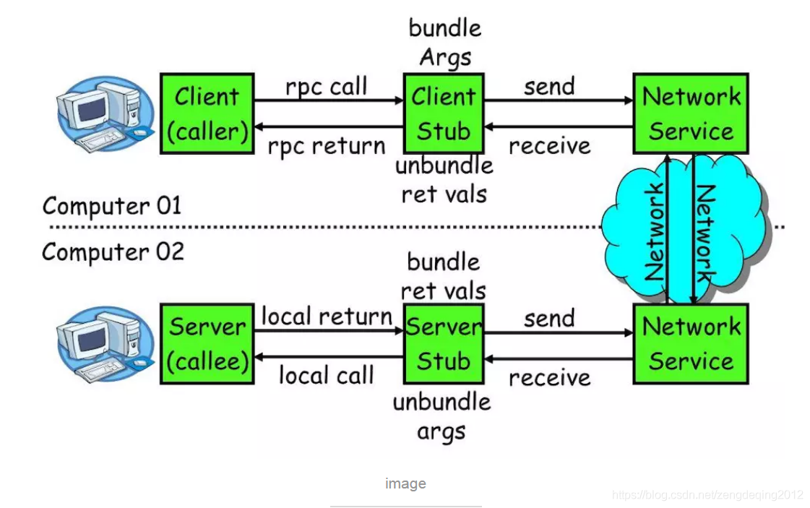

# 服务端测试
[toc]
## restapi接口测试框架

### 框架解决的问题
+ 测试数据怎么和用例分开，
+ 测试用例怎么组织
+ 一些通用的方法如何复用
+ 如何记录日志
+ 怎样生成报告
+ 测试用例如何调调度执行

### 框架结构

```
apiteststudy/
├── config
│   ├── __init__.py
│   └── config.py  # 配置
├── data
│   ├── test.xlsx
│   └── 接口测试用例.xls # 测试数据
├── lib
│   ├── HTMLTestRunner.py  # html测试报告 python2
│   ├── HTMLTestRunner_PY3.py # html测试报告 python3
│   ├── __init__.py
│   ├── case_log.py  # 记录测试过程中的日志
│   ├── readexceldata.py # 从excel读取测试数据
│   └── send_mail.py # 发送邮件
├── log
│   └── log.txt #日志文件
├── report
│   └── Report.html #报告文件
└── test
    ├── __init__.py
    ├── testcase  # 测试用例目录
    │   ├── __init__.py
    │   └── user
    │       ├── __init__.py
    │       ├── clear_users.py 
    │       ├── get_token.py
    │       └── test_user.py # 测试用例类
    └── testsuit
        ├── __init__.py
        ├── all_start.py #运行全部测试用例
        └── custome.py # 运行指定测试用例
```
+ config 配置目录
+ data 数据目录
+ lib 公共库目录
+ log 日志目录
+ report 报告目录
+ test 测试用例

### 框架代码
从群文件下载apiteststudy.zip


### 框架运行
运行前设置环境变量
windows
PYTHONPATH的值为项目所在目录
`set PYTHONPATH=D:\python\python-test-dev\Chapter-05\code`

linux
PYTHONPATH的值为项目所在目录
`export PYTHONPATH=xxxxx`

## RPC

进程间通信（IPC，Inter-Process Communication），指至少两个进程或线程间传送数据或信号的一些技术或方法。进程是计算机系统分配资源的最小单位。每个进程都有自己的一部分独立的系统资源，彼此是隔离的。为了能使不同的进程互相访问资源并进行协调工作，才有了进程间通信。这些进程可以运行在同一计算机上或网络连接的不同计算机上。 进程间通信技术包括消息传递、同步、共享内存和远程过程调用(RPC)。 

简单的说，

+ RPC就是从一台机器（客户端）上通过参数传递的方式调用另一台机器（服务器）上的一个函数或方法（可以统称为服务）并得到返回的结果。
+ RPC 会隐藏底层的通讯细节（不需要直接处理Socket通讯或Http通讯） RPC 是一个请求响应模型。
+ 客户端发起请求，服务器返回响应。RPC 在使用形式上像调用本地函数（或方法）一样去调用远程的函数（或方法）。

### rpc框架
一个 RPC 的核心功能主要有 5 个部分组成，分别是：客户端、客户端 Stub、网络传输模块、服务端 Stub、服务端等。


+ 客户端（Client）：服务调用方。
+ 客户端存根（Client Stub）：存放服务端地址信息，将客户端的请求参数数据信息打包成网络消息，再通过网络传输发送给服务端。
+ 服务端存根（Server Stub）：接收客户端发送过来的请求消息并进行解包，然后再调用本地服务进行处理。
+ 服务端（Server）：服务的真正提供者。
+ Network Service：底层传输，可以是 TCP 或 HTTP。

### RPC 序列化
序列化是将内存对象转化为字节流的过程。相对的是反序列化，即将字节流转化为内存对象的过程

为什么需要序列化？将数据存入文件或者通过网络进行发送，就需要将数据对象转化为字节流。

常见的序列化方案
1. 使用特定语言的序列化模块如python，pickle
2. 使用通用的语言格式，比如json、xml
3. 序列化框架（probuf，thrift等）

注意：而由于 Thrift、可以生成 RPC 实现，所以当提到如 Thrift 服务这种说法时一般指的是 Thrift 实现的 RPC 服务端。而 Protobuf 没有 RPC 实现，所以指的就是序列化与反序列化操作，一般会结合 gRPC 来进行 RPC 实现

序列化框架特点
+ 提供 IDL（Interface Description language）描述数据格式
+ 支持跨语言交互，比如使用 Java 开发服务端，Python 作为客户端读取数据
+ 数据编码存储，对数据进行压缩等处理，尽可能减少存储占用

### python原生rpc xmlrpc

我们来看一个简单rpc例子，使用python的自带xmlrpc库
server.py
```
from xmlrpc.server import SimpleXMLRPCServer

# 创建一个服务
with SimpleXMLRPCServer(('localhost', 8000)) as server:

    # 定义函数add
    def add(x, y):
        return x + y
    # 注册函数add
    server.register_function(add)
    # 启动服务
    server.serve_forever()
```

client.py
```
import xmlrpc.client

s = xmlrpc.client.ServerProxy('http://localhost:8000')
print(s.add(2,3))
```

运行服务端启动服务
`python server.py`
运行客户端得到结果5
`python client.py`

注意：这里是在同一台机器上执行两个程序，当然也可以在不同的机器上执行，这是localhost就要换成sever.py运行的机器的ip

XML-RPC 可以让我们很容易的构造一个简单的远程调用服务。你所需要做的仅仅是创建一个服务器实例， 通过它的方法 register_function() 来注册函数，然后使用方法 serve_forever() 启动它


### thrift

thrift 是一个支持跨语言通信的RPC框架，Thrift为数据传输，数据序列化和应用程序级处理提供了抽象和实现。其代码生成系统将简单的定义语言作为输入，并跨编程语言生成代码，使不同语言能够构建可互操作的RPC客户端和服务器


#### 安装thrift编译器

thrift 命令可以根据idl(接口描述语言)文件直接生成相应语言的代码
+ winows
https://downloads.apache.org/thrift/0.13.0/thrift-0.13.0.exe

+ macos
`brew install thrift`


#### 安装thrift 模块
`pip install thrift`

#### 编写idl
tutorial.thrif
```
service Calculator  {

   void ping(),

   i32 add(1:i32 num1, 2:i32 num2),

}
```

#### 使用thrift编译器生成python代码
`thrift.exe -out . --gen py tutorial.thrift`
+ `-out .`  指定生成代码的目录为当前目录
+ `--gent py` 生成python语言的thrift代码
+ `tutorial.thrift`  指定idl文件

该命令就是根据指定idl文件生成python相关代码放在tutorial目录,这些代码我们将在服务端和客户端中使用。它们用来定义数据类型，服务和方法。
生成目录tutorial
```
tutorial
├── Calculator-remote
├── Calculator.py
├── __init__.py
├── constants.py
└── ttypes.py
```

#### 4. 运行服务端
PythonServer.py
```
from tutorial import Calculator


from thrift.transport import TSocket
from thrift.transport import TTransport
from thrift.protocol import TBinaryProtocol
from thrift.server import TServer


class CalculatorHandler:
    def __init__(self):
        self.log = {}

    def ping(self):
        print('ping()')

    def add(self, n1, n2):
        print('add(%d,%d)' % (n1, n2))
        return n1 + n2

if __name__ == '__main__':
    handler = CalculatorHandler()
    processor = Calculator.Processor(handler)
    transport = TSocket.TServerSocket(host='127.0.0.1', port=9090)
    tfactory = TTransport.TBufferedTransportFactory()
    pfactory = TBinaryProtocol.TBinaryProtocolFactory()

    server = TServer.TSimpleServer(processor, transport, tfactory, pfactory)

    print('Starting the server...')
    server.serve()
    print('done.')

```


`python .\PythonServer.py`


#### 运行客户端
```python

from tutorial import Calculator


from thrift import Thrift
from thrift.transport import TSocket
from thrift.transport import TTransport
from thrift.protocol import TBinaryProtocol


def main():
    # 创建socket，连接localhost的9090端口
    transport = TSocket.TSocket('localhost', 9090)

    # 使用带buffer 传输层协议
    transport = TTransport.TBufferedTransport(transport)

    # 使用TBinaryProtocol protocal
    protocol = TBinaryProtocol.TBinaryProtocol(transport)

    # 创建client
    client = Calculator.Client(protocol)

    # 连接服务端
    transport.open()
    # 调用服务ping方法
    client.ping()
    print('ping()')
    # 调用服务端add方法
    sum_ = client.add(1, 1)
    print('1+1=%d' % sum_)


    # 关闭连接
    transport.close()


if __name__ == '__main__':
    try:
        main()
    except Thrift.TException as tx:
        print('%s' % tx.message)

```
`python .\PythonClient.py`

### grpc


#### 安装grpc

`pip install grpcio`

#### 安装grpc tools

`pip install grpcio-tools`


#### 编写idl
```
syntax = "proto3";

package helloworld;

// The greeting service definition.
service Greeter {
  // Sends a greeting
  rpc SayHello (HelloRequest) returns (HelloReply) {}
}

// The request message containing the user's name.
message HelloRequest {
  string name = 1;
}

// The response message containing the greetings
message HelloReply {
  string message = 1;
}
```

#### 使用grpc tools生成编译代码

`python -m grpc_tools.protoc -I protos --python_out=. --grpc_python_out=. protos/helloworld.proto`

#### 编写服务端

```python
from concurrent import futures

import grpc

import helloworld_pb2
import helloworld_pb2_grpc


class Greeter(helloworld_pb2_grpc.GreeterServicer):

    def SayHello(self, request, context):
        return helloworld_pb2.HelloReply(message='Hello, %s!' % request.name)


def serve():
    server = grpc.server(futures.ThreadPoolExecutor(max_workers=10))
    helloworld_pb2_grpc.add_GreeterServicer_to_server(Greeter(), server)
    server.add_insecure_port('[::]:50051')
    server.start()
    server.wait_for_termination()


if __name__ == '__main__':
    serve()

```


#### 编写客户端
```python
from __future__ import print_function

import grpc

import helloworld_pb2
import helloworld_pb2_grpc


def run():
    # NOTE(gRPC Python Team): .close() is possible on a channel and should be
    # used in circumstances in which the with statement does not fit the needs
    # of the code.
    with grpc.insecure_channel('localhost:50051') as channel:
        stub = helloworld_pb2_grpc.GreeterStub(channel)
        response = stub.SayHello(helloworld_pb2.HelloRequest(name='you'))
    print("Greeter client received: " + response.message)


if __name__ == '__main__':
    run()
```

### dubbo

dubbo是一款高性能、轻量级的开源 Java 服务框架。提供了六大核心能力：
+ 面向接口代理的高性能RPC调用
+ 智能容错和负载均衡
+ 服务自动注册和发现
+ 高度可扩展能力
+ 运行期流量调度
+ 可视化的服务治理与运维

根据上面可知dubbo不仅仅是一个rpc框架，而是一个服务治理框架

#### dubbo架构


[dabbo架构详细文档](https://dubbo.apache.org/zh/docs/v2.7/dev/design/)

+ cousumer 服务调用方
+ provider 服务提供方
+ registry 注册中心
+ monitor 监控中心

#### java环境配置

##### windows
1. 安装jdk
从群文件下载jdk-8u191-windows-x64.exe 

2. 配置环境变量
设置path环境变量添加路径C:\Program Files\Java\jdk1.8.0_191\bin

3. 添加JAVA_HOME 环境变量
设置路径为 C:\Program Files\Java\jdk1.8.0_191

4. 安装maven
从群文件下载apache-maven-3.6.1-bin.tar.gz解压
配置path环境添加路径D:\java\apache-maven-3.6.1\bin

5. 打开cmd验证
```
java -version
mvn -version
```

6. 配置maven 国内仓库镜像
打开当前用户目录在.m2 目录添加文件 settings.xml
```
<?xml version="1.0" encoding="UTF-8"?>
<settings xmlns="http://maven.apache.org/SETTINGS/1.0.0"
          xmlns:xsi="http://www.w3.org/2001/XMLSchema-instance"
          xsi:schemaLocation="http://maven.apache.org/SETTINGS/1.0.0 http://maven.apache.org/xsd/settings-1.0.0.xsd">
    <mirrors>
        <mirror>
            <id>alimaven</id>
            <name>aliyun maven</name>
            <url>http://maven.aliyun.com/nexus/content/groups/public/</url>
            <mirrorOf>central</mirrorOf>
        </mirror>
    </mirrors>
</settings>
```

##### mac

1. 安装jdk
从群文件下载jdk-8u202-macosx-x64.dmg

2. 配置环境变量
```
# 执行下面命令
export JAVA_HOME=/Library/Java/JavaVirtualMachines/jdk1.8.0_202.jdk/Contents/Home
export PATH=$JAVA_HOME/bin:$PATH
```
将上面命令追加到文件~/.zshrc 中

3. 安装maven
从群文件下载apache-maven-3.6.1-bin.tar.gz 
配置环境变量
`export PATH=/usr/local/apache-maven-3.6.1/bin:$PATH`

将上面命令追加到文件~/.zshrc 中
4. 打开terminal验证
java -version
mvn -version

5. 配置maven 国内仓库镜像
打开当前用户目录在.m2 目录添加文件 settings.xml
```
<?xml version="1.0" encoding="UTF-8"?>
<settings xmlns="http://maven.apache.org/SETTINGS/1.0.0"
          xmlns:xsi="http://www.w3.org/2001/XMLSchema-instance"
          xsi:schemaLocation="http://maven.apache.org/SETTINGS/1.0.0 http://maven.apache.org/xsd/settings-1.0.0.xsd">
    <mirrors>
        <mirror>
            <id>alimaven</id>
            <name>aliyun maven</name>
            <url>http://maven.aliyun.com/nexus/content/groups/public/</url>
            <mirrorOf>central</mirrorOf>
        </mirror>
    </mirrors>
</settings>
```


### dubbo 服务治理
使用zookeeper作为注册中心，实现服务的注册与发现
1. 安装zookeeper

从群文件下载apache-zookeeper-3.7.0-bin.tar.gz 解压

创建conf/zoo.cfg文件
```
# The number of milliseconds of each tick
tickTime=2000
# The number of ticks that the initial 
# synchronization phase can take
initLimit=10
# The number of ticks that can pass between 
# sending a request and getting an acknowledgement
syncLimit=5
# the directory where the snapshot is stored.
# do not use /tmp for storage, /tmp here is just 
# example sakes.
dataDir=../data
# the port at which the clients will connect
clientPort=2181
# the maximum number of client connections.
# increase this if you need to handle more clients
#maxClientCnxns=60
#
# Be sure to read the maintenance section of the 
# administrator guide before turning on autopurge.
#
# http://zookeeper.apache.org/doc/current/zookeeperAdmin.html#sc_maintenance
#
# The number of snapshots to retain in dataDir
#autopurge.snapRetainCount=3
# Purge task interval in hours
# Set to "0" to disable auto purge feature
#autopurge.purgeInterval=1

## Metrics Providers
#
# https://prometheus.io Metrics Exporter
#metricsProvider.className=org.apache.zookeeper.metrics.prometheus.PrometheusMetricsProvider
#metricsProvider.httpPort=7000
#metricsProvider.exportJvmInfo=true


```

2. 启动zookeeper

windows
进入bin目录执行`zkServer.cmd`

linux 
进入bin目录执行`zkServer.sh start`

验证：
windows
zkCli.cmd

linux

zkcli.sh


3. dubbo-samples-api

从群文件下载dubbo-samples-api.zip解压进入 dubbo-samples-api目录

执行命令`mvn clean pacakge`

启动provider`mvn -Djava.net.preferIPv4Stack=true -Dexec.mainClass=org.apache.dubbo.samples.provider.Application exec:java`

启动client`mvn -Djava.net.preferIPv4Stack=true -Dexec.mainClass=org.apache.dubbo.samples.client.Application -Ddubbo.application.qos.enable=false  exec:java`


