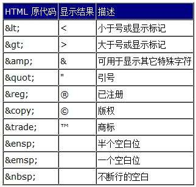
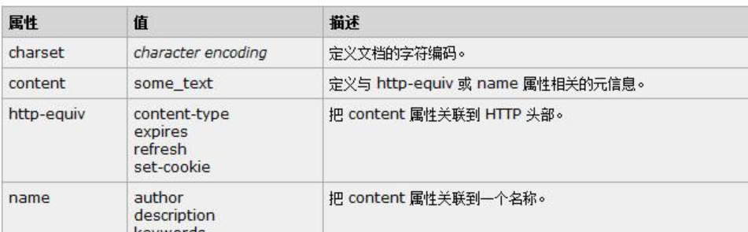

#  html
[toc]

## html 基础

HTML 是一种相当简单的、由不同元素组成的标记语言，它可用于表示文本片段，使文本在文档中具有不同的含义（段落、项目列表、表格），将文档结构化为逻辑块（头部、主体、导航菜单），并且可以将图片，影像等内容嵌入到页面中。

HTML由一系列的元素组成, 可以使用它来封装，标记内容的不同部分


### html 元素


1. 元素的构成

* 开始标签 `<p>` 表示一个段落的开始
* 结束标签 `</p>` 表示一个段落结束
* 内容 开始标签和结束标签之间的部分
* 元素  开始标签+内容+结束标签 

2. 嵌套

元素里可以嵌套另一个元素

`<p>我的<strong>html</strong></p>`

所有的元素都需要正确的打开和关闭

3. 块级元素和行内元素

* 块级元素在页面中以块的形式展现 —— 相对与其前面的内容它会出现在新的一行，其后的内容也会被挤到下一行展现。块级元素通常用于展示页面上结构化的内容，例如段落、列表、导航菜单、页脚等等。一个以block形式展现的块级元素不会被嵌套进内联元素中，但可以嵌套在其它块级元素中


* 行内(内联)元素不能通常出现在块级元素中,包裹文档内容的一小部分，而不是一整个段落或者一组内容。行内元素不会导致文本换行：它通常出现在一堆文字之间例如超链接元素`<a>`或者强调元素`<em>`

看下面例子
```
<em>一</em><em>二</em><em>三</em>

<p>四</p><p>五</p><p>六</p>
```

`<em>` 是一个行内元素，所以就像你在下方可以看到的，第一行代码中的三个元素都没有间隙的展示在了同一行。而`<p>`是一个块级元素，所以第二行代码中的每个元素分别都另起了新的一行展现，并且每个段落间都有空行

块级元素与行内元素有几个关键区别：
+ 格式：
默认情况下，块级元素会新起一行。
+ 内容模型：
一般块级元素可以包含行内元素和其他块级元素。这种结构上的包含继承区别可以使块级元素创建比行内元素更”大型“的结构。

4. 空元素
不是所有元素都拥有开始标签，内容和结束标签. 一些元素只有一个标签，通常用来在此元素所在位置插入/嵌入一些东西 。例如：元素是用来在元素所在位置插入一张指定的图片。例子如下：
```

```

### 属性
元素可以有属性


属性包含元素的额外信息，这些信息不会出现在实际的内容中。在上述例子中，这个class属性给元素赋了一个识别的名字，这个名字可以css所使用

一个属性必须包含如下内容：

* 在元素和属性之间有个空格 (如果有一个或多个已存在的属性，就与前一个属性之间有一个空格)
* 属性后面紧跟着一个=号
* 有一个属性值,由一对引号""引起来

例子

```
<a href="https://github.com/jiam/python-dev" title="python-dev" target="_blank">教程</a>
```

* href: 这个属性声明超链接的web地址，当这个链接被点击浏览器会跳转至href声明的web地址
* title: 标题title 属性为超链接声明额外的信息
* target: 目标target 属性指定将用于打开链接的方式,target="_blank" 将在新标签页中打开链接


布尔属性

有时你会看到没有值的属性，这些属性被称为布尔属性，他们只能有跟它的属性名一样的属性值。例如 disabled 属性，他们可以标记表单输入使之变为不可用(变灰色)，此时用户不能向他们输入任何数据
布尔属性的值
```
<input type="text" disabled="disabled">
<input type="text">
```
布尔属性的值可以没有
```
<input type="text" disabled>
<input type="text">
```
常见bool属性
checked, selected,readonly,hidden

### html文档结构
```
<!DOCTYPE html>
<html>
  <head>
    <meta charset="utf-8">
    <title>我的测试页</title>
  </head>
  <body>
    <p>这是我的一个页面</p>
  </body>
</html>
```

* `<!DOCTYPE html>`: 声明文档类型
* `<html></html>: <html>`元素。这个元素包裹了整个完整的页面，是一个根元素。  
* `<head></head>: <head>`元素. 这个元素是一个容器，它包含了所有你想包含在HTML页面中但不想在HTML页面中显示的内容。
这些内容包括你想在搜索结果中出现的关键字和页面描述，CSS样式，字符集声明等等。
* `<meta charset="utf-8">`: 这个元素设置文档使用utf-8字符集编码

* `<title></title>`: 设置页面标题，出现在浏览器标签上，当你标记/收藏页面时它可用来描述页面。
* `<body></body>: <body>`元素。 包含了访问页面时所有显示在页面上的内容，文本，图片，音频，游戏等等

### HTML中的空白

无论你用了多少空白(包括空白字符，包括换行), 当渲染这些代码的时候，HTML解释器会将连续出现的空白字符减少为一个单独的空格符

```
<p>Dogs are silly.</p>

<p>Dogs        are
         silly.</p>
```
这面两个写法效果是相同的

### html中的特殊字符

常见特殊字符


### HTML注释
为了将一段HTML中的内容置为注释，你需要将其用特殊的记号`<!--和-->`包括起来， 比如：
```
<p>I'm not inside a comment</p>

<!-- <p>I am!</p> -->
```

### html 元数据



```
<meta charset="utf-8">
<meta http-equiv="X-UA-Compatible" content="IE=edge">
<meta name="application-name" content="Python.org">
```


### 在HTML中应用CSS和JavaScript

你使用的所有网站都会使用 CSS 让网页更加炫酷, 使用JavaScript让网页有交互功能, 比如视频播放器，地图，游戏以及更多功能。
这些应用在网页中很常见，它们分别使用 `<link>`元素以及` <script> `元素

```
<!-- 本地新闻 -->
<script src="//www.163.com/special/00774J00/index_news_keys.js" charset="gbk"></script>
<!-- 第三方合作新闻推荐 -->
<link href="https://static.ws.126.net/f2e/www/index20170701/collect/head~DIhBY9NJYLhd.css" rel="stylesheet" />
```


### HTML 文本格式元素

标题、段落
```
<h1>The Crushing Bore</h1>

<p>By Chris Mills</p>

<h2>Chapter 1: The Dark Night</h2>

<p>It was a dark night. Somewhere, an owl hooted. The rain lashed down on the ...</p>

<h2>Chapter 2: The eternal silence</h2>

<p>Our protagonist could not so much as a whisper out of the shadowy figure ...</p>

<h3>The specter speaks</h3>

<p>Several more hours had passed, when all of a sudden the specter sat bolt upright and exclaimed, "Please have mercy on my soul!"</p>
```

无序列表

```
<ul>
  <li>牛奶</li>
  <li>鸡蛋</li>
  <li>面包</li>
  <li>鹰嘴豆泥</li>
</ul>

```
有序列表

```
<ol>
  <li>行驶到这条路的尽头</li>
  <li>向右转</li>
  <li>直行穿过第一个双环形交叉路</li>
  <li>在第三个环形交叉路左转</li>
  <li>学校就在你的右边，300米处</li>
</ol>
```

嵌套列表

```
<ol>
  <li>Remove the skin from the garlic, and chop coarsely.</li>
  <li>Remove all the seeds and stalk from the pepper, and chop coarsely.</li>
  <li>Add all the ingredients into a food processor.</li>
  <li>Process all the ingredients into a paste.
    <ul>
      <li>If you want a coarse "chunky" humous, process it for a short time.</li>
      <li>If you want a smooth humous, process it for a longer time.</li>
    </ul>
  </li>
</ol>
```

斜体字、粗体字、下划线
```
<!-- scientific names -->
<p>
  The Ruby-throated Hummingbird (<i>Archilocus colubris</i>)
  is the most common hummingbird in Eastern North America.
</p>

<!-- foreign words -->
<p>
  The menu was a sea of exotic words like <i lang="uk-latn">vatrushka</i>,
  <i lang="id">nasi goreng</i> and <i lang="fr">soupe à l'oignon</i>.
</p>

<!-- a known misspelling -->
<p>
  Someday I'll learn how to <u>spel</u> better.
</p>

<!-- Highlight keywords in a set of instructions -->
<ol>
  <li>
    <b>Slice</b> two pieces of bread off the loaf.
  </li>
  <li>
    <b>Insert</b> a tomato slice and a leaf of
    lettuce between the slices of bread.
  </li>
</ol>
```

### 表格

```
<table>
<tr>
<th>选择器</th>
<th>例子</th>
<th>例子描述</th>
<th>CSS</th>
</tr>

<tr>
<td><a href="/cssref/selector_class.asp" title="CSS .class 选择器">.<i>class</i></a></td>
<td>.intro</td>
<td>选择 class=&quot;intro&quot; 的所有元素。</td>
<td>1</td>
</tr>

<tr>
<td><a href="/cssref/selector_id.asp" title="CSS #id 选择器">#<i>id</i></a></td>
<td>#firstname</td>
<td>选择 id=&quot;firstname&quot; 的所有元素。</td>
<td>1</td>
</tr>
</table>
```

### 表单

用户提交数据

```
<form action="http://foo.com" method="get">
  <div>
    <label for="say">What greeting do you want to say?</label>
    <input name="say" id="say" value="Hi">
  </div>
  <div>
    <label for="to">Who do you want to say it to?</label>
    <input name="to" id="to" value="Mom">
  </div>
  <div>
    <button>Send my greetings</button>
  </div>
</form>
```
* action 属性: 数据要提交到额url，在本例中，数据被发送到 —— http://foo.com
* method属性:  提交数据使用的http方法 ，本例get
```
GET /?say=Hi&to=Mom HTTP/1.1
Host: foo.com

POST / HTTP/1.1
Host: foo.com
Content-Type: application/x-www-form-urlencoded
Content-Length: 13

say=Hi&to=Mom
```

发送文件
```
<form method="post" enctype="multipart/form-data">
  <div>
    <label for="file">Choose a file</label>
    <input type="file" id="file" name="myFile">
  </div>
  <div>
    <button>Send the file</button>
  </div>
</form>
```
* enctype 该属性允许指定在提交表单时所生成的请求中的Content-Type的HTTP数据头的值，默认值application/x-www-form-urlencoded。
意思是为发送的数据指定编码格式

校验数据

强制必填
```
<form>
  <label for="choose">Would you prefer a banana or cherry?</label>
  <input id="choose" name="i_like" required>
  <button>Submit</button>
</form>
```

required 属性 必填

限制长度
```
<form>
  <div>
    <label for="choose">Would you prefer a banana or a cherry?</label>
    <input id="choose" name="i_like" required minlength="6" maxlength="6">
  </div>
  <div>
    <label for="number">How many would you like?</label>
    <input type="number" id="number" name="amount" value="1" min="1" max="10">
  </div>
  <div>
    <button>Submit</button>
  </div>
</form>
```

### 表单组件

+ 文本输入
```
<input type="text" id="comment" name="comment" value="I'm a text field">
```

+ E-mail 地址
```
<input type="email" id="email" name="email" multiple>
```
通过包括multiple属性，可以让用户将多个电子邮件地址输入相同的输入(以逗号分隔)

+ 密码
```
<input type="password" id="pwd" name="pwd">
```

+ 搜索
```
<input type="search" id="search" name="search">
```
+ 多行文本
```
<textarea cols="30" rows="10"></textarea>
```

+ 下拉选择框
```
<select id="simple" name="simple">
  <option>Banana</option>
  <option>Cherry</option>
  <option>Lemon</option>
</select>
```

+ 多选框
```
<select multiple id="multi" name="multi">
  <option>Banana</option>
  <option>Cherry</option>
  <option>Lemon</option>
</select>
```

+ 复选框
```
<input type="checkbox" id="carrots1" name="carrots1" value="carrots1">
<input type="checkbox" id="carrots2" name="carrots2" value="carrots2">
```
+ 单选按钮
```
<input type="radio"  id="soup1" name="meal" value=1>
<input type="radio"  id="soup2" name="meal" value=2>
```
+ 按钮

提交
```
<button type="submit">
    This a <br><strong>submit button</strong>
</button>

<input type="submit" value="This is a submit button">
```

重置
```
<button type="reset">
    This a <br><strong>reset button</strong>
</button>

<input type="reset" value="This is a reset button">
```

## css
CSS 指层叠样式表 (Cascading Style Sheets),它允许我们将布局和设计添加到html页面，

### html中使用css

+ 外部样式表(External style sheet)
+ 内部样式表(Internal style sheet)
+ 行内样式(Inline style)

#### 外部样式表


单独使用一个css文件来保存样式，独立html文件，通过在`<head>` 元素中定义`<link>`元素来引用css文件
这样一个css文件可以被多个需要的html文件使用。

`<link>` 链接html文件外的资源
+ rel属性 指定link的文件类型
+ href属性 用于标识CSS文件的位置。

```
<head>
  <link rel="stylesheet" href="main.css">
</head>

```

为了CSS正确呈现，href属性值的路径必须直接关联到我们的CSS文件保存的位置，
在前面的示例中，main.css文件存储在与HTML文件相同的位置。

如果我们的CSS文件位于子目录或子文件夹内，则href属性值需要相应地与此路径相关联。
例如，如果我们的main.css文件存储在名为stylesheets的子目录中，那么href属性值将是stylesheets/main.css

#### 内部样式表（内联样式表）
当单个文档需要特殊的样式时，就应该使用内部样式表。你可以使用` <style>` 标签在文档头部定义内部样式表

```
<head>
<style>
hr {border: 5px solid red;}
p {margin-left:20px;}
</style>
</head>
<hr>
<p>内部样式表</p>
```

#### 行内样式表
```
<p style="color:sienna;margin-left:20px">这是一个段落。</p>`
```

### 选择器
当元素被添加到网页中时，可以使用CSS进行样式化。选择器用来定位HTML中的哪些元素应用样式（例如颜色，大小和位置）
选择器可以包含不同限定符（元素类型，class，id）的组合，以选择独特的元素。例如，我们可能希望选择页面上的每个段落，或者我们可能只想在页面上选择一个特定的段落。
选择器通常以属性值为目标，例如id或class值，或者定位元素的类型，例如`<h1>`或`<p>`

在CSS中，选择器后跟大括号{}，其中包含要应用于所选元素的样式。下面的选择器是针对所有的`<p>`元素

```
p {
  color: orange;
  font-size: 16px;
}
```

在CSS中，我们的规则集以选择器开头，后面紧跟着大括号。在这些大括号内是由属性和值对组成的声明，每个声明都以一个属性开头，后面跟着冒号，属性值，最后是分号。


**使用选择器**

如前所述，选择器表示对哪些HTML元素进行样式化。充分了解如何使用选择器以及如何利用选择器非常重要。
第一步是熟悉不同类型的选择器。我们将从最常见的选择器开始：类型，类和ID选择器。

元素类型选择器

类型选择器按元素类型定位元素。例如，如果我们希望定位所有的div元素，我们将使用div的类型选择器
以下代码显示了除法元素的类型选择器以及它选择的相应HTML

````
# css
div { ... }

# html
<div>...</div>          
<div>...</div>
````

元素类属性选择器

类选择器允许我们根据元素的类属性值选择一个元素。类选择器比类型选择器更具体，因为它们选择一组特定的元素而不是一种类型的所有元素。类选择器允许我们通过跨多个元素使用相同的类属性值，一次将相同的样式应用于不同的元素。
在CSS中，类由前导点表示，后跟类属性值。下面类选择器将选择包含awesome类属性值的任何元素，包括分割元素和段落元素

```
# css
.red { ... }
# html
<div class="red">...</div>
<p class="red">...</p>
```


ID 选择器

ID选择器比类选择器更精确，因为它们一次只能定位一个独特的元素。就像类选择器使用元素的类属性值作为选择器一样，ID选择器使用元素的id属性值作为选择器。无论它们出现在哪种类型的元素上，每个页面使用的id属性值必须唯一。如果使用它们应该保留用于重要元素。
在CSS中，ID选择符由前导散列符号＃表示，后跟id属性值。这里ID选择器将只选择包含shayhowe的id属性值的元素。

```
# css
#name { ... }
<div id="name">...</div>
```
分组选择器
假设希望 `<h2>` 元素和 `<p>`都是灰色。为达到这个目的，最容易的做法是使用以下声明
```
h2, p {color:gray;}
```
将 `<h2>` 和 `<p>` 选择器放在规则左边，然后用逗号分隔，就定义了一个规则。其右边的样式（color:gray;）将应用到这两个选择器所引用的元素
。逗号告诉浏览器，规则中包含两个不同的选择器。如果没有这个逗号，那么规则的含义将完全不同

[示例](./Chapter-06/css-example11.html)

[示例](./Chapter-06/css-example12.html)

通配符选择器
通配选择器，显示为一个星号（*）。该选择器可以与任何元素匹配，就像是一个通配符。例如，下面的规则可以使文档中的每个元素都为红色：

[示例](./Chapter-06/css-example13.html)

后代选择器

后代选择器（descendant selector）又称为包含选择器。后代选择器可以选择作为某元素后代的元素
我们可以定义后代选择器来创建一些规则，使这些规则在某些文档结构中起作用，而在另外一些结构中不起作用。

举例来说，如果您希望只对 h1 元素中的 em 元素应用样式，可以这样写

[示例](./Chapter-06/css-example14.html)

[示例](./Chapter-06/css-example15.html)

子元素选择器

如果不希望选择任意的后代元素，而是希望缩小范围，只选择某个元素的子元素，请使用子元素选择器（Child selector）。
例如，如果希望选择只作为 h1 元素子元素的 strong 元素，可以这样写：
[示例](./Chapter-06/css-example16.html)


### Box Model 盒子模型

#### 如何显示元素

如何显示元素，由display属性决定。每个元素都有一个默认的display属性值;但是，与所有其属性的值一样，该值可能会被覆盖。最常见的是block, inline, inline-block, 和none

每个元素都有默认的display值，根据display的值可分为 块（block）元素，行内（inline）元素和 内嵌（inline-block）元素

block元素独占一行，并且可以设置width,height，margin，padding属性。

inline元素不会独占一行，多个相邻的行内元素会排列在同一行里，直到一行排列不下，才会新换一行，其宽度随元素的内容而变化，
inline元素设置width,height属性无效

inline-block 元素呈现为inline对象，让block元素不再独占一行，多个block元素可以同排一行，且元素具有block的属性，
可设置width、height是block和inline元素的综合体

none 使元素不显示


我们可以通过在CSS中设置显示display的值来更改元素的显示属性值。

[示例](./Chapter-06/example1.html)

#### 什么是Box Model(盒子模型)

根据盒子模型概念，页面上的每个元素都是一个矩形框，并且可以具有width(宽度)，height(高度)，padding(填充)，border(边框)和margin(边距)。
*页面上的每个元素都是一个矩形框* 每个页面上的每个元素都符合盒子模型

每个元素都是一个矩形框，并且有width、height、padding、border、margin几个属性决定了该框的大小.

````
div {
  border: 6px solid #949599;
  height: 100px;
  margin: 20px;
  padding: 20px;
  width: 400px;
}

````

#### Width & Height

元素宽度

````
div {
  width: 400px;
}
````
元素高度
````
div {
  height: 100px;
}

````
Margin(边距) & Padding(填充)

根据元素的不同，浏览器可以将默认边距和填充应用于元素，以帮助提高易读性和清晰度。
margin属性允许我们设置元素周围的空间量，元素的边距（margin）落在边框（border）之外，并且颜色完全透明。
边距可用于帮助将元素定位在页面上的特定位置，与所有其他元素保持安全距离。
````
div {
  margin: 20px;
}

````

填充（padding）属性与边距（margin）属性非常相似;但是，如果元素具有边框（border），则它落在元素的边框（border）内。


#### 设置magrin和padding

````
div {
  margin: 20px;
}
````
以上方式设置元素的4个方向margin值均为20px

如果上下和左右的值不同,设置方式如下
````
div {
  margin: 10px 20px;
}

````

10px 为上下的值，20px为左右的值

如果上下左右各不同。设置方式如下
````
div {
  margin: 10px 20px 0 15px;
}

````

上（top） 10px，右（right）20px，下（bottom）0,左（left）15px  方向为顺时针

也可以单独设置某个方向的值，如：
````
div {
  margin-top: 10px;
  padding-left: 6px;
}

````

边距（magin）和填充（padding）是完全透明的，不接受任何颜色值。但是，它们显示相对元素的背景颜色
对于边距，我们看到父元素的背景颜色，对于填充，我们看到应用填充的元素的背景颜色

#### Borders

边框（border）位于填充（padding）和边距（margin）之间，提供围绕元素的轮廓。
边框（border）属性需要三个值：宽度（width），样式（style）和颜色（color）。
````
div {
  border: 6px solid #949599;
}

````

边框（border）的style常见的有solid, double, dashed, dotted, 和 none

[示例](./Chapter-06/example3.html)


单独设置border的各个边，border-top, border-right, border-bottom, 和 border-left
````
div {
  border-bottom: 6px solid #949599;
}

````

另外，可以将各个边界侧的样式控制在更精细的水平。例如，如果我们只希望更改底部边框的宽度，我们可以使用以下代码
````
div {
  border-bottom-width: 12px;
}

````
可选top, right, bottom, 和left

border-radius属性，使我们能够对元素的角进行圆角处理。border-radius属性接受长度单位，包括百分比和像素，用于标识元素的角的半径
````
div {
  border-radius: 5px;
}

````

[示例](./Chapter-06/example4.html)

## [bootstrap](http://www.runoob.com/bootstrap4/bootstrap4-tutorial.html)

#### [网格系统](https://www.runoob.com/bootstrap4/bootstrap4-grid-basic.html)

#### [表格](https://www.runoob.com/bootstrap4/bootstrap4-tables.html)

#### [导航](https://www.runoob.com/bootstrap4/bootstrap4-navs.html)

#### [导航栏](https://www.runoob.com/bootstrap4/bootstrap4-navbar.html)

#### [表单](https://www.runoob.com/bootstrap4/bootstrap4-forms.html)
#### [表单控件](https://www.runoob.com/bootstrap4/bootstrap4-forms-inputs.html)

#### [输入框组](https://www.runoob.com/bootstrap4/bootstrap4-forms-input-group.html)

#### [模态](https://www.runoob.com/bootstrap4/bootstrap4-modal.html)

#### [一个网页](https://www.runoob.com/bootstrap4/bootstrap4-makeawebsite.html)

#### [boostrap-admin实例](https://startbootstrap.com/template-overviews/sb-admin/)

