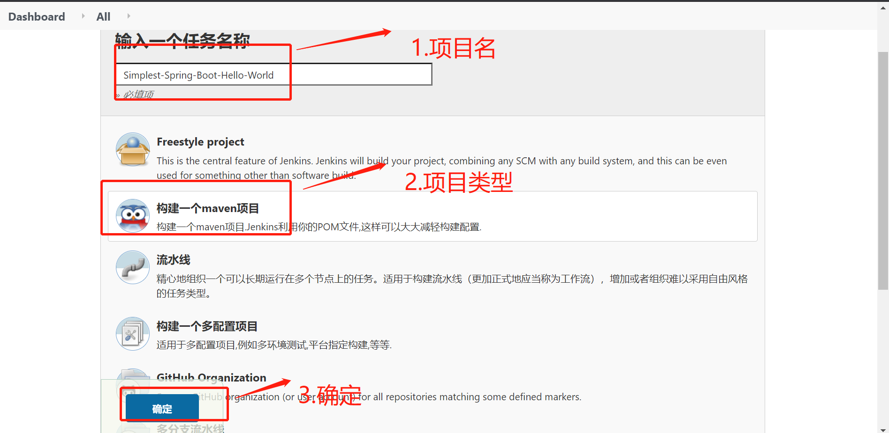

# sonar

## sonar介绍
Sonar（SonarQube）是一个开源平台，用于管理源代码的质量。Sonar 不只是一个质量数据报告工具，更是代码质量管理平台。支持的语言包括：Java、C/C++、C#、Python、Go、PHP、JavaScript等。

Sonar可以从以下维度检测代码质量

+ 不遵循代码标准 sonar可以通过PMD,CheckStyle,Findbugs等等代码规则检测工具规 范代码编写
+ 潜在的缺陷 sonar可以通过PMD,CheckStyle,Findbugs等等代码规则检测工具检 测出潜在的缺陷
+ 糟糕的复杂度分布 文件、类、方法等，如果复杂度过高将难以改变，这会使得开发人员 难以理解它们 且如果没有自动化的单元测试，对于程序中的任何组件的改变都将可能导致需要全面的回归测试
+ 重复 显然程序中包含大量复制粘贴的代码是质量低下的，sonar可以展示 源码中重复严重的地方
+ 注释不足或者过多 没有注释将使代码可读性变差，特别是当不可避免地出现人员变动 时，程序的可读性将大幅下降 而过多的注释又会使得开发人员将精力过多地花费在阅读注释上，亦违背初衷
+ 缺乏单元测试 sonar可以很方便地统计并展示单元测试覆盖率
+ 糟糕的设计

sonarqube包含三个部分

1. 扫描分析器
2. SonarQube Server
3. 数据库


## sonarqube服务搭建

1. 拉取sonarqube镜像

`docker pull sonarqube`

2. 创建本地卷
```shell
docker volume create --name sonarqube_data
docker volume create --name sonarqube_logs
docker volume create --name sonarqube_extensions

# 查看卷
docker volume ls

# 数据卷的位置为
ls /var/lib/docker/volumes
```

3. 启动容器
```shell
docker run -d --name sonarqube \
    -p 9000:9000 \
    -v sonarqube_data:/opt/sonarqube/data \
    -v sonarqube_extensions:/opt/sonarqube/extensions \
    -v sonarqube_logs:/opt/sonarqube/logs \
    sonarqube
```

4. 查看容器日志
 
`docker logs -f sonarqube`

5. 启动界面

默认账户/密码 admin/admin

6. 安装中文语言包

如果不能安装成功，可以使用离线安装
```shell
# 进入目录
cd var/lib/docker/volumes/sonarqube_extensions/_data/plugins

# 下载插件
wget https://github.com/xuhuisheng/sonar-l10n-zh/releases/download/sonar-l10n-zh-plugin-8.5/sonar-l10n-zh-plugin-8.5.jar

```
重启sonarqube

`docker restart sonarqube`


## 使用sonarscanner进行扫描

1. 下载sonaer-sancnner-cli

创建目录
`mkdir /root/sonar&& cd /root/sonar`

下载sonar-scanner-cli
`wget https://binaries.sonarsource.com/Distribution/sonar-scanner-cli/sonar-scanner-cli-4.5.0.2216-linux.zip`

2.  安装unzip

`yum install unzip`

3. 解压sonar-scanner-cli-4.5.0.2216-linux.zip

`unzip sonar-scanner-cli-4.5.0.2216-linux.zip`

4. 配置环境变量
当前连接生效
`export PATH=$PATH:/root/sonar/sonar-scanner-4.5.0.2216-linux/bin`

写入.bashrc文件,使重新连接后环境变量仍然生效
`echo "export PATH=$PATH:/root/sonar/sonar-scanner-4.5.0.2216-linux/bin" >>root/.bashrc`

5. plumemo.tar.gz 上传到/root/blog目录并解压

`tar zxvf plumemo.tar.gz`

6. 安装jdk和maven
```
yum install java-11-openjdk
yum install maven
```
配置maven仓库
修改/etc/maven/settings.xml文件在mirrors部分添加以下配置
```
<mirror>
  <id>aliyunmaven</id>
  <mirrorOf>*</mirrorOf>
  <name>阿里云公共仓库</name>
  <url>https://maven.aliyun.com/repository/public</url>
</mirror>
```

7. 进去plumemo 进行构建

`mvn package`
完成后会生成一个target目录，里面为编译后的产物


8. 执行sonar-scanner

创建文件sonar-project.properties 
```
sonar.projectKey=my:project

sonar.projectName=My project
sonar.projectVersion=1.2.0
sonar.sources=./src
sonar.sourceEncoding=UTF-8

sonar.host.url=http://localhost:9000
sonar.java.binaries=target

```
执行扫描命令
`sonar-scanner`

9. 使用浏览器访问sonarqube,查看生成报告


## sonar 主要概念

+ 可靠性： 衡量指标，bug数量
+ 可维护性：
+ 安全性：衡量指标，漏洞数
+ 安全复审：潜在的安全问题
+ 覆盖率： 单元测试代码覆盖率
+ 重复： 代码重复度
+ 复杂度：代码是否容易理解
+ 问题： bug、异味（Code Smell）、漏洞
+ 代码统计
+ 异味： 与可维护性有关的问题
+ 技术债务： 解决漏洞和可靠性问题所需的估计时间
+ 质量阈：一组条件，判断项目是否通过扫描
+ 质量配置： 一组规则集合
+ 规则：应遵循的编码标准或惯例。不遵守编码规则会导致错误，漏洞，安全热点和异味。


## 使用maven进行扫描

1. 配置sonar
编辑/etc/maven/settings.xml

在pluginGroups节点添加
```
<pluginGroup>org.sonarsource.scanner.maven</pluginGroup>
```

在profiles节点添加
```
        <profile>
            <id>sonar</id>
            <activation>
                <activeByDefault>true</activeByDefault>
            </activation>
            <properties>
                <!-- Optional URL to server. Default value is http://localhost:9000 -->
                <sonar.host.url>
                  http://localhost:9000
                </sonar.host.url>
                <sonar.login>
                xxx
                </sonar.login>
                 <sonar.password>
                xxx
                </sonar.password>

            </properties>
        </profile>

```

2. 执行命令
进入/root/blog/plumemo目录，执行

`mvn clean verify sonar:sonar`

3. 打开sonar查看


## jenkins
jenkins 开源持续集成（CI）工具
1. 构建编译
2. 自动化测试
3. 代码质量管理

### 安装jenkins
1. 下载jenkins

`cd /opt; wget https://get.jenkins.io/war-stable/2.263.1/jenkins.war`

2. 使用rz 上传jenkins.tar.gz 文件到/root目录，然后执行一下命令
 
`tar zxvf jenkins.tar.gz`

3. 启动jenkins

`nohup java -jar /opt/jenkins.war >/opt/jenkins.log 2>&1 &`

4. 查看启动日志

`tail -20 -f /opt/jenkins.log`

5. 停止firewalld进程
`systemctl stop firewalled && systemctl restart docker`

6. 访问jenkins
账户admin，密码admin


### 新建一个maven项目

1. 新建Item

2. 填写项目名称，选择项目类型

3. 填写项目详需信息

git 地址 https://github.com/jiam/Simplest-Spring-Boot-Hello-World.git

配置maven


点击保存

在项目配置页面点击保存

4. 开始构建


5. 查看构建日志


返回工程
6. 查看构建产物


### 集成sonaer
1. 安装sonar插件
Manager Jenkins->Manger Plugins->可选插件
搜索框输入sonar
选中 SonarQube Scanner
点击直接安装


2. 配置sonarqube
Manager Jenkins->Config System->SonarQube servers


3. 配置项目

进入项目 Simplest-Spring-Boot-Hello-World
配置->构建环境
选中 Prepare SonarQube Scanner environment

build 部分中的 Goals and options
改为`clean verify sonar:sonar`

4. 再次构建项目


### 将构建产物打包成docker镜像

1. Manager Jenkins->Manger Plugins->可选插件
搜索  Docker Build and Publish
安装 CloudBees Docker Build and Publish


2. 搭建docker 私有仓库

`docker run -d -p 5000:5000 --name registry registry:2`

测试docker registry

`curl http://127.0.0.1:5000/v2/_catalog`

3. 配置docker使用私有仓库

修改/etc/hosts 添加一条记录

`192.168.1.4 myhub.local`

修改/etc/docker/daemon.json
```
{
  "insecure-registries" : ["127.0.0.1:5000","myhub.local:5000"],
  "registry-mirrors": [ "https://docker.mirrors.ustc.edu.cn", "https://9cpn8tt6.mirror.aliyuncs.com" ],
  "storage-driver": "overlay2",
  "log-driver": "json-file",
  "log-opts": {
    "max-size": "10m",
    "max-file": "3"
  }
}

```

4. 配置Simplest-Spring-Boot-Hello-World
配置参数化构建

配置docker插件


5. 参数话构建


项目编译完成后，打包成docker 镜像


### 通过jenkins进行容器部署

1. 开启docker http连接

修改文件 /lib/systemd/system/docker.service 

将`ExecStart=/usr/bin/dockerd -H fd:// --containerd=/run/containerd/containerd.sock`

修改为`ExecStart=/usr/bin/dockerd -H fd:// --containerd=/run/containerd/containerd.sock  -H tcp://0.0.0.0:4243
`

然后执行
```
systemctl daemon-reload
service docker restart
```
测试docker api
` curl -s  127.0.0.1:4243/info | python -m json.tool`

docker 客户端通过http方式连接dockerd
`docker  -H tcp://192.168.1.4:4243 info`

2. 新建项目Simplest-Spring-Boot-Hello-World-deploy
选则Freestyle project -> 构建-> 增加构建步骤->Excute shell

```
#!/bin/bash
for ip in "192.168.1.4"
do
  if docker  -H tcp://$ip:4243 ps -a | grep helloword
  then
    docker  -H tcp://$ip:4243 stop helloword
    docker  -H tcp://$ip:4243 rm helloword
    docker  -H tcp://$ip:4243 run  --name=helloword  -d -p80:8080 myhub.local:5000/java/simplest-spring-boot-hello-world:v1.0
  else
    docker  -H tcp://$ip:4243 run  --name=helloword  -d -p80:8080 myhub.local:5000/java/simplest-spring-boot-hello-world:v1.0
  fi
     
done  
```


